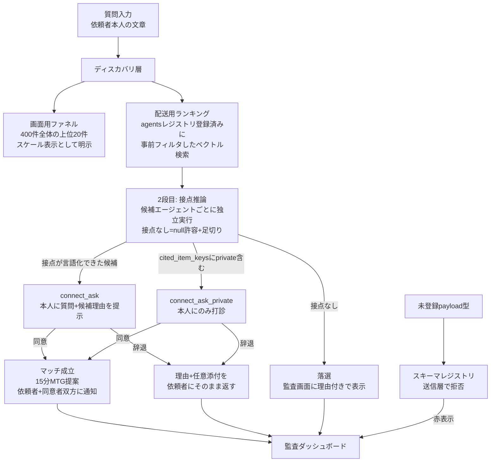

# knowledge-discovery 設計書 v7

入力: `spec.md` v5（C-22追随の文言修正を反映した版）
生成日: 2026-08-18（v5起草） / v6: 批評round-4のC-16〜C-20反映 / v7: 批評round-5のC-21〜C-25反映
状態: 改訂版（承認CP待ち）

---

## 0. スコープと原則

`spec.md` v4「人と人の暗黙知を繋いでシナジーを生み出す」を実装に落とす。残る統制原則は2点のみ:

1. **未レビューのAI生成文を、本人の発言として（本人名義で）流通させない。** AI生成文は常にAIの発言として明示する
2. **非公開項目の内容は、本人以外の誰にも開示されない。** 非公開項目は「本人のエージェントだけが知っている情報」としてマッチング打診に積極的に使われる

**v6での変更点（批評round-4由来）**:
- C-16: 候補選定を「配送用ランキング」と「画面用ファネル」の2トラックに分離。「接点なし」の出力路と足切りを追加。デモで落選候補を1件見せる
- C-17: 2段目推論を候補エージェントごとの独立呼び出しに明記（データ境界＝プロセス境界）
- C-18: public/private打診の振り分けを `cited_item_keys` × `visibility` から機械的に決定（LLMの自己申告に依存しない）
- C-19: 依頼者側の状態モデル・match_proposalのpayload・監査画面の主張範囲を定義
- C-20: レビューUIを最小化（デモ非登場）、agent discoveryを自前Firestoreレジストリ（`agents` コレクション）に実体化。添付はdocを含む3種（ユーザー判断）

**v7での変更点（批評round-5由来）**:
- C-21: マスク規則をintent別からメッセージ横断の1ルールに変更（`no_connection`経由のprivate漏出を閉塞）。監査表示をfail-closedに
- C-22: spec.md v5への文言追随（spec側で対応）
- C-23: 落選判定にベクトル類似度の決定的な下限を併用（LLM自己申告scoreへの単独依存を解消）。台本用に「確実に落ちる1体」をシード設計
- C-24: doc添付をGCS署名URLからCloud Run静的配信に変更（IAM署名権限の問題を回避）
- C-25: `supported_intents` を送信層の拒否経路（`reject_unsupported_intent`）に接続して実機能化

## 1. 全体フロー（単一レーン）



## 2. 探索的マッチング（2トラック×2段階）— 本設計の核心

### 2トラックの分離（C-16対応）

- **配送用ランキング**: `agents` レジストリ（§3）に登録済みのエージェントに対応するプロフィールのみを対象にベクトル類似度検索し、上位候補を決める。Firestoreの複合ベクトルインデックス（等価フィルタ併用）が通るかを**設計確定直後・実装最初のタスクとして**確認する（通らない場合は全件検索後にコード側フィルタで代替。400件なら性能問題なし）
- **画面用ファネル**: 400件全体に対する上位20件を「もし全社員にエージェントが居ればここまで探索できる」という**スケール表示**として監査ダッシュボードに出す。配送に寄与しない演出であることを隠さず、デモのナレーションでも「今日は4人のエージェントが稼働しています。全社展開なら、この400人が探索対象です」と言い切る（誠実なスケール訴求に転換する）

### 2段階の推論

**1段目（絞り込み）**: 配送用ランキングで登録済みエージェントの候補を出す（4体全員が対象になる規模なので、実質は2段目への入力順序付け）。

**2段目（接点推論、C-17対応）**: **候補エージェントごとに独立した推論呼び出し**を行う。
- ディスカバリ層が各候補エージェントに渡すのは**質問文のみ**。各エージェントは**自分のプロフィール全文（自分のprivate項目を含む）だけ**をコンテキストに持つ。他人のプロフィールは一切見えない（データ境界＝プロセス境界。アーキ図でFortifiedの技術的売りとして示す）
- 各エージェントの出力スキーマは `{connection: {reason_text, score} | null, no_connection_reason: string | null, cited_item_keys: string[]}` に統一する（**null時も `cited_item_keys` と `no_connection_reason` を必ず返す**。C-21対応: 落選メッセージの出所を確保し、privateを引用した落選理由もマスク検査の対象に乗せる）
  - `reason_text`: この人が背景知識を持っていそうな理由。直接一致だけでなく間接的な接点（例: 質問「製造業の商習慣の肌感」×「前職が生産管理システムのSE」）を重視するようプロンプトで指示
  - `connection: null` を明示的に許す（**「意味のある接点は見つからない」と判定してよい**とプロンプトで強調。無理に理由をひねり出さない）
- **落選判定は決定的な信号と併用する（C-23対応）**: (a) 配送用ランキングで計算済みのベクトル類似度に下限 `VECTOR_FLOOR`（暫定値はシード較正）を設け、下回れば2段目の結果に関わらず落選（決定的・再現可能な第1関門） (b) LLMの `connection: null` または `score < CONNECTION_THRESHOLD`（暫定0.5）で落選（第2関門）。ORで落とす。加えて**台本用に「確実に落ちる1体」（質問ドメインと語彙が一切重ならないプロフィール。例: 経理担当）をシード設計時に意図的に作り込む**（較正が収束しなくてもデモの落選シーンを守る保険）
- 4体分は並列実行（Gemini 3.7 Flash ×4呼び出し）
- 接点が言語化できた候補のみ（最大k=3）に配送。落選した候補は `intent=no_connection`（payload: `{reason_text: no_connection_reason, cited_item_keys, score}`）として監査ログに記録し、監査ダッシュボードに表示する（探索的マッチングが「常にYes」ではないことの反証可能な証拠。デモでも1件見せる。**デモで見せる落選候補は public 項目のみ引用のものを台本で選ぶ**）

### 探索的であることの帰結

- 誤マッチはゼロを目指さない。的外れなら候補が辞退し、辞退理由がフィードバックになる
- ただし「接点の有無を判別できない」ことは探索的の許容範囲ではなく機能不全（round-4総評）。`connection: null` の出力路がその区別を機械化する

## 3. データモデル（Firestore）

### `agents` コレクション（C-20対応、v6新規 — agent discoveryの実体）

```
agents/{agent_id}
  ├─ employee_id: string          # 対応する社員
  ├─ display_name: string
  ├─ supported_intents: string[]  # このエージェントが受信できるintent（例: ["connect_ask", "connect_ask_private"]）
  ├─ endpoint: string             # ADK上の呼び出し先（デモでは論理名）
  ├─ registered_at: timestamp
  └─ active: boolean
```

- 旧設計の `profiles.implemented: boolean` をレジストリレコードに昇格。ディスカバリ層は配送前にこのレジストリを引き、**登録済み・activeなエージェントにのみ配送する**
- **`supported_intents` は送信層の拒否経路に接続する（C-25対応）**: 宛先エージェントの `supported_intents` に含まれない intent のメッセージは `intent=reject_unsupported_intent`・`rejected=true` で送信拒否し、監査画面に赤表示する（既存の `reject_unregistered_type` と同じ機構を再利用。レジストリが実際に流量を止める統制機構になる）
- スキーマレジストリ（payload型の統制）と並べて「**誰が居るか（agent discovery）＋何を流せるか（統制）＋何が流れたか（監査）**」の3点セットとしてアーキ図・write-upで語る（Fortifiedトラック名への直接回答）

### `profiles` コレクション

```
profiles/{employee_id}
  ├─ name: string
  ├─ role: string
  ├─ items: [
  │    {
  │      key: "current_work" | "expertise" | "background" | <自由キー>,
  │      body: string,
  │      source: "job_doc" | "seed_synth",
  │      visibility: "public" | "private",
  │      reviewed: boolean
  │    }, ...
  │  ]
  └─ embedding: vector            # 全項目（public+private）から生成
```

- `current_work` はマッチングの主材料のため詳細に書く（シードデータ設計指針）。396体の合成プロフィールも同一schema
- `implemented` フィールドは廃止（`agents` レジストリの有無で判定）

### `messages` コレクション（エンベロープ・監査ログ兼用）

```
messages/{audit_id}
  ├─ from / to: string
  ├─ intent: "query" | "connect_ask" | "connect_ask_private" | "no_connection"
  │          | "consent_reply" | "match_proposal" | "decline_with_reason"
  │          | "reject_unregistered_type" | "reject_unsupported_intent"
  ├─ payload_type: string
  ├─ payload: map
  ├─ audit_payload: map | null    # 監査表示用（connect_ask_privateのみpayloadと異なる。C-18）
  ├─ consent_state: "n/a" | "pending" | "granted" | "declined"
  ├─ timestamp: timestamp
  └─ rejected: boolean
```

主要payload:
- `connect_ask` / `connect_ask_private`: `{question_summary, reason_text, cited_item_keys, score}`
- `no_connection`: `{reason_text, cited_item_keys, score}`（なぜ接点なしと判定したか。出所は2段目出力の `no_connection_reason`。C-21対応）
- `decline_with_reason`: `{reason_text, attachment?: {type: "link"|"text"|"doc", content}}`
  - `doc` は**Cloud Run自身の静的配信**（`/attachments/<id>` を同一サービスから返す）とする（C-24対応: GCS署名URLはCloud RunデフォルトSAに秘密鍵がなく実行時に失敗する既知の罠があり、社内デモの脅威モデルでは署名URLの必然性もないため採用しない。既存の単一APIキー保護の内側に収まる）。アップロードUIは作らず、辞退画面では事前配置済みファイルの選択とする
- `match_proposal`: `{meeting_duration: 15, proposed_by: "system", participants: [依頼者id, 同意者id]}`。**`reason_text` を含めない**（依頼者に届くのは相手名・MTG提案・同意状態のみ。C-19対応、private内容の漏出経路も1本塞がる）

### privateマスクの機械的適用（C-18/C-21対応、メッセージ横断の1ルール）

- **ルール（intent別ではなくメッセージ横断）**: `cited_item_keys` に `visibility=="private"` の項目が1つでも含まれる**すべてのメッセージ**について、送信層が `audit_payload`（`{masked: true, note: "非公開項目に基づく<intent名>（内容非表示）", score, cited_count}`）を生成する。`connect_ask` → `connect_ask_private` へのintent確定はこのルールの副次規則とする（LLMが出力したintentは採用しない。判定主体をLLMから型システムに移す）。`no_connection` も同一ルールでマスクされる
- **監査表示はfail-closed（C-21対応）**: 監査ダッシュボードが `audit_payload == null` のときに `payload` を表示してよい `payload_type` は、スキーマレジストリ側のホワイトリストで明示する。ホワイトリスト外・`audit_payload` 生成漏れの場合は「表示不可（マスク既定）」にフォールバックする（intentを追加し忘れても平文表示に倒れない）
- write-up・アーキ図では「エージェントの自己申告に依存しない統制」として説明する。ただしこの主張の適用範囲はpublic/private振り分けとマスクであり、接点推論そのものはLLM出力である（誇張しない。§2の決定的信号との併用がその補完）

### スキーマレジストリ

`payload_type` ごとにJSON Schemaをコード内定数で定義。送信層で検証し、未登録型は `reject_unregistered_type`・`rejected=true` で拒否。宛先の `supported_intents` 検証（`reject_unsupported_intent`）も送信層で行う（§agentsレジストリ参照）。監査表示のfail-closedホワイトリストもここで管理する。

### アクセス制御

- `agents`・`profiles`・`messages` はFirestore Security Rulesでクライアント直接読み書き禁止。Cloud RunサーバーAPI経由のみ
- UIの保護はデモ用の簡易な全体保護（Cloud Run IAMまたは単一APIキー）のみ

## 4. 非公開項目打診

1. 2段目推論で候補本人のprivate項目が接点として検出された場合（`cited_item_keys` にprivate項目が含まれる場合）、§3の機械的振り分けにより `connect_ask_private` として本人にのみ打診: 「この質問は、あなたの非公開項目『◯◯』に関係しそうです。つながりますか？」
2. 同意した場合: 通常のマッチ成立フロー。`match_proposal` に `reason_text` は含まれないため、**依頼者向けUIには非公開項目がきっかけだったことは一切表示されない**。明かすかどうかは会った本人がその場で判断する
3. 辞退した場合: 通常の辞退として返す。依頼者向けUIには非公開項目の存在を示す情報を出さない
4. **監査画面での主張範囲（C-19対応で明確化）**: 監査ダッシュボードには「非公開項目に基づく打診が行われた**事実**」は表示される（`connect_ask_private` の行として。内容は `audit_payload` でマスク済み）。これは監査の要件として正当であり、「事実は記録され、内容は誰にも見えない」がFortified向けの正確な主張。「存在自体を伝えない」のは**依頼者向けUIに限る**（spec FR8の「開示されない」は内容についての規定であり、監査ログの存在記録とは両立する）

## 5. 辞退フロー

1. 候補本人は辞退時に、理由（自由記述）と、任意で添付（`link` / `text` / `doc`）を付けられる
2. `decline_with_reason` として依頼者にそのまま届く。表示例: 「◯◯さん: 今週は立て込んでいて難しいです。この資料が参考になるかも → [リンク]」
3. 隠蔽機構はない。監査ダッシュボードにもそのまま表示される

## 6. マッチ成立フローと依頼者側の状態モデル（C-19対応）

1. 同意（`consent_reply(granted)`）を受けたら `match_proposal` を依頼者と同意者の双方に発行
2. 複数候補が同意した場合: 全員とのMTG提案を発行してよい（つながりを増やすことが目的）
3. タイムアウト: 応答待ちに時限は設けない。**依頼者画面の状態語彙は「返答待ち」で固定し、未応答のまま終わってよい**とデモ台本に明記する（実運用での未応答の扱いはwrite-upの将来項目）
4. **依頼者画面の状態モデル**: 候補ごとに `返答待ち → つながりました（MTG提案あり）/ 今回は難しいそうです（理由+添付表示）` の3状態のみ。`connect_ask_private` 由来かどうかは依頼者画面の表示に一切反映しない（通常の候補と区別できない見た目にする）
5. **デモ台本の推奨**: k=3配送のうち、1体同意・1体辞退（資料添付付き）・1体は接点なしで落選（配送されない）という構成にすると、「返答待ち」が画面に残らず3状態が全て1画面で見える

## 7. 監査ダッシュボード

- Cloud RunサーバーAPI経由で `messages` を時系列表示（誰が・何を・同意状態）
- 画面用ファネル「400件→上位20件（スケール表示）→接点推論4件→配送n件（落選m件、理由付き）」を表示
- 辞退も理由・添付ごと表示。マスクは `audit_payload` ルール（`connect_ask_private` の内容非表示）のみ
- `rejected=true` の行は赤背景
- `no_connection`（落選）の行は理由付きで通常色表示（探索的マッチングの反証可能性の証拠）

## 8. 技術スタック

- ADK（Python）+ Gemini 3.7 Flash（全用途）+ Cloud Run + Firestore
- Cloud RunサービスアカウントはFirestoreへの最小権限。Gemini APIキーはSecret Manager。doc添付はCloud Run静的配信のためGCS・署名権限は不要（C-24）
- **GEAP対応は「使わなかった理由の説明」ではなく「責務の1対1対応表」で示す（round-5総評反映）**: アーキ図に以下の対応表を載せ、「推奨技術が担う3責務を全て最小実装で実現し、置換点を明示した」という積極的な主張にする。`agents` レジストリのフィールド名はGEAP Agent Registryのagent card相当（agent_id / capabilities≒supported_intents / endpoint）に意図的に寄せる

| 責務 | 本実装 | GEAP本番構成での置換先 |
|---|---|---|
| 誰が居るか（agent discovery） | `agents` レジストリ（Firestore） | GEAP Agent Registry |
| 何を流せるか（統制） | スキーマレジストリ＋`supported_intents`検証（送信層） | Model Armor |
| 何が流れたか（監査） | `messages` コレクション＋監査ダッシュボード | Agent Observability |

## 9. プロフィール生成・レビュー（最小化。C-20ユーザー判断）

1. 下書き生成はバッチスクリプト（模擬職務文書→Gemini 3.7 Flash→Firestore投入）。UIなし
2. レビュー画面は**visibilityトグルのみの最小1画面**。本文修正はFirestore直編集で代替。デモ動画には登場させない
3. レビュー確定で `reviewed=true` 一括更新＋embedding再生成
4. spec FR2/FR3はこの最小実装で充足する（デモに映る必要はない）

## 10. 検証可能なゴール

1. サンプル質問→登録済みエージェント4体で接点推論が独立に4並列実行され、接点が言語化できた候補のみ（最大3体）に配送されることを確認できる
2. 質問と無関係な候補（例: 経理担当。台本用に語彙が重ならないよう意図設計した1体）に対し落選判定（ベクトル下限またはLLMのnull）が発火し、`no_connection` として監査画面に理由付きで表示されることを確認できる（**探索的マッチングが「常にYes」でないことの証拠。最重要ゴール**）
3. 「候補になった理由」に間接的な接点が言語化されたケースを、シード由来の質問3種のうち少なくとも1種で確認できる
4. `cited_item_keys` にprivate項目が含まれる場合、機械的に `connect_ask_private` になり、本人にのみ打診が届き、監査画面では内容がマスクされ、依頼者画面には通常候補と区別できない表示になることを確認できる。**private項目を引用した `no_connection`（落選）も同様にマスクされることを確認できる**（C-21対応）
4b. 宛先エージェントの `supported_intents` に含まれないintentのメッセージが `reject_unsupported_intent` として拒否され、監査画面に赤表示されることを確認できる（C-25対応）
5. 同意→`match_proposal`（reason_textを含まない）が依頼者・同意者双方に届くことを確認できる
6. 辞退（理由＋link添付・doc添付それぞれ）→依頼者に理由と添付がそのまま表示されることを確認できる
7. 未登録 `payload_type` の送信が拒否され、監査画面に赤表示されることを確認できる
8. `agents` レジストリに4件、`profiles` に400件が存在し、レジストリ未登録のプロフィールには配送されないことを確認できる
9. 異なる質問3種で画面用ファネルの上位20件が変化することを確認できる
10. 用語（レビュー/同意/公開範囲）が統一され「承認」が使われていないことを確認できる
11. クライアントSDKからの直接読み取りがSecurity Rulesで拒否されることを確認できる

## 11. デモ動画の構成（3分・英語）

1. **幸福経路（〜100秒）**: 暗黙知系の質問 → 監査画面でファネル「400件（スケール表示）→接点推論→配送3件・落選1件（理由付き）」 → 候補本人の画面に質問＋AI推定の候補理由 → 1体同意→MTG成立が双方に届く／1体辞退（資料添付）→依頼者に届く（§6-5の台本構成）
2. **非公開項目打診（〜40秒）**: private項目を持つ候補への打診が本人にだけ届く → 監査画面では「内容非表示」の行 → 依頼者画面では通常候補と見分けがつかない → ナレーション「開示するかどうかは、本人だけが決める」
3. **統制の3点セット（〜20秒）**: アーキ図カットで `agents` レジストリ（誰が居るか）＋スキーマレジストリ（何を流せるか）＋監査ログ（何が流れたか）を示す。尺が余れば未登録型の拒否（赤表示）を実演

## 12. spec.md v4との対応

| spec機能要件 | 対応箇所 |
|---|---|
| FR1-3（エージェント・プロフィール・レビュー） | §3, §9 |
| FR4（探索的な上位k選定） | §2 |
| FR5（質問＋候補理由の提示、AI発言明示） | §2 |
| FR6（同意→MTG提案） | §6 |
| FR7（辞退理由＋添付） | §5 |
| FR8（非公開項目の打診・非開示） | §3, §4 |
| FR9-11（エンベロープ・レジストリ・監査記録） | §3 |
| FR12（監査ダッシュボード） | §7 |
| FR13（400名分投入） | §3 |
| FR14（デモ構成） | §11 |
| FR15（アーキ図・write-up） | 実装後タスク（§8のGEAP言及、§4-4の主張範囲を反映すること） |

## 13. 未決のまま残す事項

- デモの舞台・模擬社員4名の人物設定（8/19までに決定。シードデータ設計のクリティカルパス。「確実に落ちる1体」の意図設計を含む）
- 辞退理由の入力形式（自由記述のみ / テンプレ併用）
- k=3・ファネル20件・`CONNECTION_THRESHOLD`（暫定0.5）・`VECTOR_FLOOR` は暫定値。シードデータで較正する。**較正が収束しない場合のフォールバック**: 台本用に意図設計した「確実に落ちる1体」はベクトル下限（決定的）だけで落ちるため、LLM score の較正が不安定でもデモの落選シーンは成立する（C-23）
- Firestore複合ベクトルインデックス（レジストリ登録済みフィルタ併用）の可否確認は**実装最初のタスク**（不可なら全件検索+コード側フィルタで代替、400件なら性能問題なし）
- 2段目推論4並列の1回あたりレイテンシ実測
