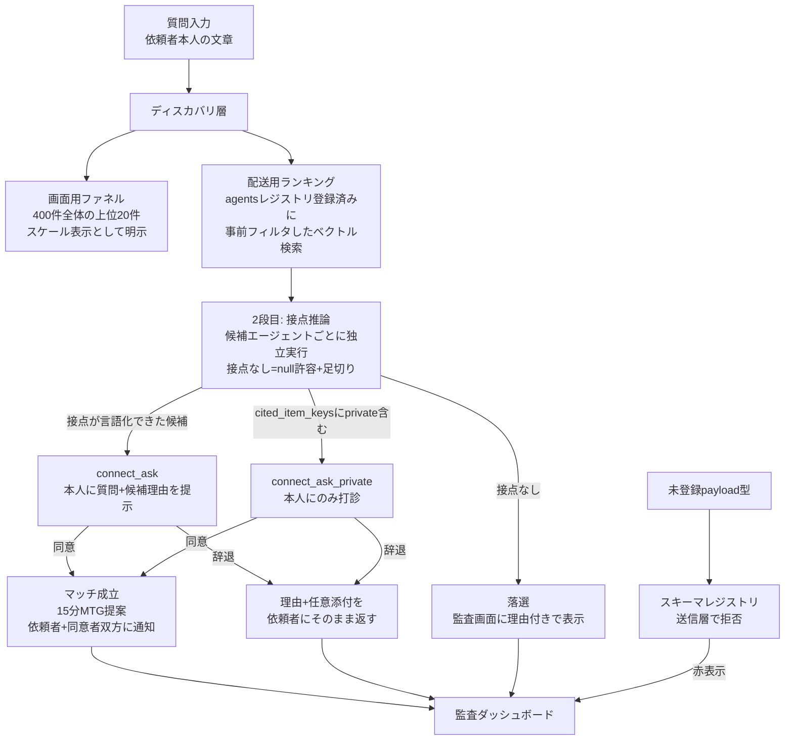
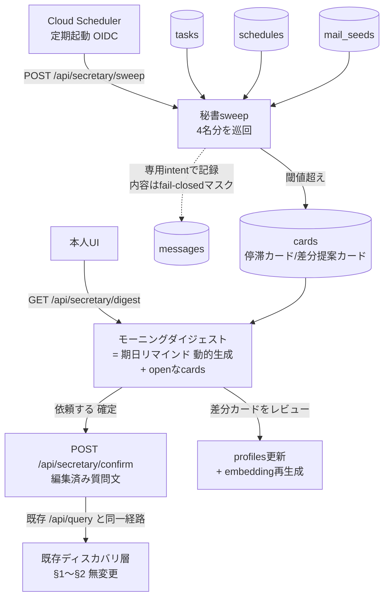

# knowledge-discovery 設計書 v11

入力: `spec.md` v7（v1〜v15は v5 入力のまま変更なし。§14以降が v7 の FR16〜24 に対応）
生成日: 2026-08-18（v5起草） / v6: 批評round-4のC-16〜C-20反映 / v7: 批評round-5のC-21〜C-25反映 / v8: M3秘書プロアクティブ層の追補（2026-08-19。§14〜、§10/§11/§12/§15に追記） / v9: 批評round-7（claude C-26〜C-30 + codex X-1〜X-5）反映 / v10: B段（Agent Runtime載せ替え）の詳細化（2026-08-23、ユーザー決定「B段を実施」を受けて§14.7を追補。A段は本番稼働済み・反証round-8/9クローズ済み） / v11: 批評round-10（claude C-31〜C-35 + codex Y-1〜Y-5）反映
状態: 改訂版（承認CP待ち。v9承認済み部分は無変更、追補は§14.7 B段・§8対応表・§10ゴール19〜22・§15）

**v9での変更点（批評round-7由来）**:
- C-26/X-1: プレビュー専用の `embedding_public` を新設（1段目ランキングからもprivateの影響を排除）。プレビューと正式実行の候補差は仕様として明示しUI文言に反映
- C-27/X-5: Scheduler起動をOIDCからAPIキーヘッダ方式に変更（実デプロイの `--allow-unauthenticated`＋DEMO_API_KEY と両立）。本番構成のOIDCはwrite-up将来項目へ。A段の定期起動に検証ゴール18aを追加
- C-28: 日付基準 `DEMO_TODAY` を導入（シードは相対日付から生成、収録日ずれに耐える）
- C-29: `deliver=False` フラグ案を廃止。プレビューは送信層に到達し得ない純粋関数の直接呼び出しとする（構造的無痕跡）
- C-30/X-2/X-3: cards の状態機械を明文化（tier昇格・自動終了・dismissed/confirmed後の再発火規則・confirmのCAS・プレビュー0件）
- X-4: `profiles.items.source` に `"mail_seed"` を追加
- 枠外指摘: mail_seed由来項目の visibility 既定は public（業務由来デフォルト公開の原則に従う）と明記

**v8の設計方針（追補の背骨）**: 秘書は**新しい配送経路を持たない**。既存の配送・同意・監査フロー（M1/M2実装済み・反証round-6クローズ済み）には一切手を入れず、その**入口の手前に「気づく・調べる・下書きする」段を足すだけ**とする。人を巻き込む操作は常に既存フローの起点（質問投入）を経由する。

---

## 0. スコープと原則

`spec.md` v4「人と人の暗黙知を繋いでシナジーを生み出す」を実装に落とす。残る統制原則は2点のみ:

1. **未レビューのAI生成文を、本人の発言として（本人名義で）流通させない。** AI生成文は常にAIの発言として明示する
2. **非公開項目の内容は、本人以外の誰にも開示されない。** 非公開項目は「本人のエージェントだけが知っている情報」としてマッチング打診に積極的に使われる

**v6での変更点（批評round-4由来）**:
- C-16: 候補選定を「配送用ランキング」と「画面用ファネル」の2トラックに分離。「接点なし」の出力路と足切りを追加。デモで落選候補を1件見せる
- C-17: 2段目推論を候補エージェントごとの独立呼び出しに明記（データ境界＝プロセス境界）
- C-18: public/private打診の振り分けを `cited_item_keys` × `visibility` から機械的に決定（LLMの自己申告に依存しない）
- C-19: 依頼者側の状態モデル・match_proposalのpayload・監査画面の主張範囲を定義
- C-20: レビューUIを最小化（デモ非登場）、agent discoveryを自前Firestoreレジストリ（`agents` コレクション）に実体化。添付はdocを含む3種（ユーザー判断）

**v7での変更点（批評round-5由来）**:
- C-21: マスク規則をintent別からメッセージ横断の1ルールに変更（`no_connection`経由のprivate漏出を閉塞）。監査表示をfail-closedに
- C-22: spec.md v5への文言追随（spec側で対応）
- C-23: 落選判定にベクトル類似度の決定的な下限を併用（LLM自己申告scoreへの単独依存を解消）。台本用に「確実に落ちる1体」をシード設計
- C-24: doc添付をGCS署名URLからCloud Run静的配信に変更（IAM署名権限の問題を回避）
- C-25: `supported_intents` を送信層の拒否経路（`reject_unsupported_intent`）に接続して実機能化

## 1. 全体フロー（単一レーン）



## 2. 探索的マッチング（2トラック×2段階）— 本設計の核心

### 2トラックの分離（C-16対応）

- **配送用ランキング**: `agents` レジストリ（§3）に登録済みのエージェントに対応するプロフィールのみを対象にベクトル類似度検索し、上位候補を決める。Firestoreの複合ベクトルインデックス（等価フィルタ併用）が通るかを**設計確定直後・実装最初のタスクとして**確認する（通らない場合は全件検索後にコード側フィルタで代替。400件なら性能問題なし）
- **画面用ファネル**: 400件全体に対する上位20件を「もし全社員にエージェントが居ればここまで探索できる」という**スケール表示**として監査ダッシュボードに出す。配送に寄与しない演出であることを隠さず、デモのナレーションでも「今日は4人のエージェントが稼働しています。全社展開なら、この400人が探索対象です」と言い切る（誠実なスケール訴求に転換する）

### 2段階の推論

**1段目（絞り込み）**: 配送用ランキングで登録済みエージェントの候補を出す（4体全員が対象になる規模なので、実質は2段目への入力順序付け）。

**2段目（接点推論、C-17対応）**: **候補エージェントごとに独立した推論呼び出し**を行う。
- ディスカバリ層が各候補エージェントに渡すのは**質問文のみ**。各エージェントは**自分のプロフィール全文（自分のprivate項目を含む）だけ**をコンテキストに持つ。他人のプロフィールは一切見えない（データ境界＝プロセス境界。アーキ図でFortifiedの技術的売りとして示す）
- 各エージェントの出力スキーマは `{connection: {reason_text, score} | null, no_connection_reason: string | null, cited_item_keys: string[]}` に統一する（**null時も `cited_item_keys` と `no_connection_reason` を必ず返す**。C-21対応: 落選メッセージの出所を確保し、privateを引用した落選理由もマスク検査の対象に乗せる）
  - `reason_text`: この人が背景知識を持っていそうな理由。直接一致だけでなく間接的な接点（例: 質問「製造業の商習慣の肌感」×「前職が生産管理システムのSE」）を重視するようプロンプトで指示
  - `connection: null` を明示的に許す（**「意味のある接点は見つからない」と判定してよい**とプロンプトで強調。無理に理由をひねり出さない）
- **落選判定は決定的な信号と併用する（C-23対応）**: (a) 配送用ランキングで計算済みのベクトル類似度に下限 `VECTOR_FLOOR`（暫定値はシード較正）を設け、下回れば2段目の結果に関わらず落選（決定的・再現可能な第1関門） (b) LLMの `connection: null` または `score < CONNECTION_THRESHOLD`（暫定0.5）で落選（第2関門）。ORで落とす。加えて**台本用に「確実に落ちる1体」（質問ドメインと語彙が一切重ならないプロフィール。例: 経理担当）をシード設計時に意図的に作り込む**（較正が収束しなくてもデモの落選シーンを守る保険）
- 4体分は並列実行（Gemini 3.7 Flash ×4呼び出し）
- 接点が言語化できた候補のみ（最大k=3）に配送。落選した候補は `intent=no_connection`（payload: `{reason_text: no_connection_reason, cited_item_keys, score}`）として監査ログに記録し、監査ダッシュボードに表示する（探索的マッチングが「常にYes」ではないことの反証可能な証拠。デモでも1件見せる。**デモで見せる落選候補は public 項目のみ引用のものを台本で選ぶ**）

### 探索的であることの帰結

- 誤マッチはゼロを目指さない。的外れなら候補が辞退し、辞退理由がフィードバックになる
- ただし「接点の有無を判別できない」ことは探索的の許容範囲ではなく機能不全（round-4総評）。`connection: null` の出力路がその区別を機械化する

## 3. データモデル（Firestore）

### `agents` コレクション（C-20対応、v6新規 — agent discoveryの実体）

```
agents/{agent_id}
  ├─ employee_id: string          # 対応する社員
  ├─ display_name: string
  ├─ supported_intents: string[]  # このエージェントが受信できるintent（例: ["connect_ask", "connect_ask_private"]）
  ├─ endpoint: string             # ADK上の呼び出し先（デモでは論理名）
  ├─ registered_at: timestamp
  └─ active: boolean
```

- 旧設計の `profiles.implemented: boolean` をレジストリレコードに昇格。ディスカバリ層は配送前にこのレジストリを引き、**登録済み・activeなエージェントにのみ配送する**
- **`supported_intents` は送信層の拒否経路に接続する（C-25対応）**: 宛先エージェントの `supported_intents` に含まれない intent のメッセージは `intent=reject_unsupported_intent`・`rejected=true` で送信拒否し、監査画面に赤表示する（既存の `reject_unregistered_type` と同じ機構を再利用。レジストリが実際に流量を止める統制機構になる）
- スキーマレジストリ（payload型の統制）と並べて「**誰が居るか（agent discovery）＋何を流せるか（統制）＋何が流れたか（監査）**」の3点セットとしてアーキ図・write-upで語る（Fortifiedトラック名への直接回答）

### `profiles` コレクション

```
profiles/{employee_id}
  ├─ name: string
  ├─ role: string
  ├─ items: [
  │    {
  │      key: "current_work" | "expertise" | "background" | <自由キー>,
  │      body: string,
  │      source: "job_doc" | "seed_synth" | "mail_seed",
  │      visibility: "public" | "private",
  │      reviewed: boolean
  │    }, ...
  │  ]
  ├─ embedding: vector            # 全項目（public+private）から生成
  └─ embedding_public: vector     # public項目のみから生成（v9新設。プレビュー検索§14.4専用。§9-3の再生成時に両方更新）
```

- `current_work` はマッチングの主材料のため詳細に書く（シードデータ設計指針）。396体の合成プロフィールも同一schema
- `implemented` フィールドは廃止（`agents` レジストリの有無で判定）

### `messages` コレクション（エンベロープ・監査ログ兼用）

```
messages/{audit_id}
  ├─ from / to: string
  ├─ intent: "query" | "connect_ask" | "connect_ask_private" | "no_connection"
  │          | "consent_reply" | "match_proposal" | "decline_with_reason"
  │          | "reject_unregistered_type" | "reject_unsupported_intent"
  ├─ payload_type: string
  ├─ payload: map
  ├─ audit_payload: map | null    # 監査表示用（connect_ask_privateのみpayloadと異なる。C-18）
  ├─ consent_state: "n/a" | "pending" | "granted" | "declined"
  ├─ timestamp: timestamp
  └─ rejected: boolean
```

主要payload:
- `connect_ask` / `connect_ask_private`: `{question_summary, reason_text, cited_item_keys, score}`
- `no_connection`: `{reason_text, cited_item_keys, score}`（なぜ接点なしと判定したか。出所は2段目出力の `no_connection_reason`。C-21対応）
- `decline_with_reason`: `{reason_text, attachment?: {type: "link"|"text"|"doc", content}}`
  - `doc` は**Cloud Run自身の静的配信**（`/attachments/<id>` を同一サービスから返す）とする（C-24対応: GCS署名URLはCloud RunデフォルトSAに秘密鍵がなく実行時に失敗する既知の罠があり、社内デモの脅威モデルでは署名URLの必然性もないため採用しない。既存の単一APIキー保護の内側に収まる）。アップロードUIは作らず、辞退画面では事前配置済みファイルの選択とする
- `match_proposal`: `{meeting_duration: 15, proposed_by: "system", participants: [依頼者id, 同意者id]}`。**`reason_text` を含めない**（依頼者に届くのは相手名・MTG提案・同意状態のみ。C-19対応、private内容の漏出経路も1本塞がる）

### privateマスクの機械的適用（C-18/C-21対応、メッセージ横断の1ルール）

- **ルール（intent別ではなくメッセージ横断）**: `cited_item_keys` に `visibility=="private"` の項目が1つでも含まれる**すべてのメッセージ**について、送信層が `audit_payload`（`{masked: true, note: "非公開項目に基づく<intent名>（内容非表示）", score, cited_count}`）を生成する。`connect_ask` → `connect_ask_private` へのintent確定はこのルールの副次規則とする（LLMが出力したintentは採用しない。判定主体をLLMから型システムに移す）。`no_connection` も同一ルールでマスクされる
- **監査表示はfail-closed（C-21対応）**: 監査ダッシュボードが `audit_payload == null` のときに `payload` を表示してよい `payload_type` は、スキーマレジストリ側のホワイトリストで明示する。ホワイトリスト外・`audit_payload` 生成漏れの場合は「表示不可（マスク既定）」にフォールバックする（intentを追加し忘れても平文表示に倒れない）
- write-up・アーキ図では「エージェントの自己申告に依存しない統制」として説明する。ただしこの主張の適用範囲はpublic/private振り分けとマスクであり、接点推論そのものはLLM出力である（誇張しない。§2の決定的信号との併用がその補完）

### スキーマレジストリ

`payload_type` ごとにJSON Schemaをコード内定数で定義。送信層で検証し、未登録型は `reject_unregistered_type`・`rejected=true` で拒否。宛先の `supported_intents` 検証（`reject_unsupported_intent`）も送信層で行う（§agentsレジストリ参照）。監査表示のfail-closedホワイトリストもここで管理する。

### アクセス制御

- `agents`・`profiles`・`messages` はFirestore Security Rulesでクライアント直接読み書き禁止。Cloud RunサーバーAPI経由のみ
- UIの保護はデモ用の簡易な全体保護（Cloud Run IAMまたは単一APIキー）のみ

## 4. 非公開項目打診

1. 2段目推論で候補本人のprivate項目が接点として検出された場合（`cited_item_keys` にprivate項目が含まれる場合）、§3の機械的振り分けにより `connect_ask_private` として本人にのみ打診: 「この質問は、あなたの非公開項目『◯◯』に関係しそうです。つながりますか？」
2. 同意した場合: 通常のマッチ成立フロー。`match_proposal` に `reason_text` は含まれないため、**依頼者向けUIには非公開項目がきっかけだったことは一切表示されない**。明かすかどうかは会った本人がその場で判断する
3. 辞退した場合: 通常の辞退として返す。依頼者向けUIには非公開項目の存在を示す情報を出さない
4. **監査画面での主張範囲（C-19対応で明確化）**: 監査ダッシュボードには「非公開項目に基づく打診が行われた**事実**」は表示される（`connect_ask_private` の行として。内容は `audit_payload` でマスク済み）。これは監査の要件として正当であり、「事実は記録され、内容は誰にも見えない」がFortified向けの正確な主張。「存在自体を伝えない」のは**依頼者向けUIに限る**（spec FR8の「開示されない」は内容についての規定であり、監査ログの存在記録とは両立する）

## 5. 辞退フロー

1. 候補本人は辞退時に、理由（自由記述）と、任意で添付（`link` / `text` / `doc`）を付けられる
2. `decline_with_reason` として依頼者にそのまま届く。表示例: 「◯◯さん: 今週は立て込んでいて難しいです。この資料が参考になるかも → [リンク]」
3. 隠蔽機構はない。監査ダッシュボードにもそのまま表示される

## 6. マッチ成立フローと依頼者側の状態モデル（C-19対応）

1. 同意（`consent_reply(granted)`）を受けたら `match_proposal` を依頼者と同意者の双方に発行
2. 複数候補が同意した場合: 全員とのMTG提案を発行してよい（つながりを増やすことが目的）
3. タイムアウト: 応答待ちに時限は設けない。**依頼者画面の状態語彙は「返答待ち」で固定し、未応答のまま終わってよい**とデモ台本に明記する（実運用での未応答の扱いはwrite-upの将来項目）
4. **依頼者画面の状態モデル**: 候補ごとに `返答待ち → つながりました（MTG提案あり）/ 今回は難しいそうです（理由+添付表示）` の3状態のみ。`connect_ask_private` 由来かどうかは依頼者画面の表示に一切反映しない（通常の候補と区別できない見た目にする）
5. **デモ台本の推奨**: k=3配送のうち、1体同意・1体辞退（資料添付付き）・1体は接点なしで落選（配送されない）という構成にすると、「返答待ち」が画面に残らず3状態が全て1画面で見える

## 7. 監査ダッシュボード

- Cloud RunサーバーAPI経由で `messages` を時系列表示（誰が・何を・同意状態）
- 画面用ファネル「400件→上位20件（スケール表示）→接点推論4件→配送n件（落選m件、理由付き）」を表示
- 辞退も理由・添付ごと表示。マスクは `audit_payload` ルール（`connect_ask_private` の内容非表示）のみ
- `rejected=true` の行は赤背景
- `no_connection`（落選）の行は理由付きで通常色表示（探索的マッチングの反証可能性の証拠）

## 8. 技術スタック

- ADK（Python）+ Gemini 3.7 Flash（全用途）+ Cloud Run + Firestore
- Cloud RunサービスアカウントはFirestoreへの最小権限。Gemini APIキーはSecret Manager。doc添付はCloud Run静的配信のためGCS・署名権限は不要（C-24）
- **GEAP対応は「使わなかった理由の説明」ではなく「責務の1対1対応表」で示す（round-5総評反映）**: アーキ図に以下の対応表を載せ、「推奨技術が担う3責務を全て最小実装で実現し、置換点を明示した」という積極的な主張にする。`agents` レジストリのフィールド名はGEAP Agent Registryのagent card相当（agent_id / capabilities≒supported_intents / endpoint）に意図的に寄せる

| 責務 | 本実装 | GEAP本番構成での置換先 |
|---|---|---|
| 誰が居るか（agent discovery） | `agents` レジストリ（Firestore） | GEAP Agent Registry |
| 何を流せるか（統制） | スキーマレジストリ＋`supported_intents`検証（送信層） | Model Armor |
| 何が流れたか（監査） | `messages` コレクション＋監査ダッシュボード | Agent Observability |
| いつ動くか（トリガー、v8追加） | A段: Cloud Scheduler（APIキーヘッダ）→ Cloud Run 同居の秘書 ／ **B段（v10）: Cloud Scheduler（OAuth）→ GEAP Agent Runtime 上の秘書 → Cloud Run API** | 同左（B段で実構成化） |

このうち「誰が居るか」は v8 で**実採用に昇格**し（GEAP Agent Registry への実登録。§14.7）、v10 のB段では Runtime秘書の**自動登録**として実現する。「いつ動くか」もB段で実構成になる。対応表の他の行は引き続き最小実装＋置換点明示のパターン。

## 9. プロフィール生成・レビュー（最小化。C-20ユーザー判断）

1. 下書き生成はバッチスクリプト（模擬職務文書→Gemini 3.7 Flash→Firestore投入）。UIなし
2. レビュー画面は**visibilityトグルのみの最小1画面**。本文修正はFirestore直編集で代替。デモ動画には登場させない
3. レビュー確定で `reviewed=true` 一括更新＋embedding・embedding_public（v9新設）の再生成
4. spec FR2/FR3はこの最小実装で充足する（デモに映る必要はない）

## 10. 検証可能なゴール

1. サンプル質問→登録済みエージェント4体で接点推論が独立に4並列実行され、接点が言語化できた候補のみ（最大3体）に配送されることを確認できる
2. 質問と無関係な候補（例: 経理担当。台本用に語彙が重ならないよう意図設計した1体）に対し落選判定（ベクトル下限またはLLMのnull）が発火し、`no_connection` として監査画面に理由付きで表示されることを確認できる（**探索的マッチングが「常にYes」でないことの証拠。最重要ゴール**）
3. 「候補になった理由」に間接的な接点が言語化されたケースを、シード由来の質問3種のうち少なくとも1種で確認できる
4. `cited_item_keys` にprivate項目が含まれる場合、機械的に `connect_ask_private` になり、本人にのみ打診が届き、監査画面では内容がマスクされ、依頼者画面には通常候補と区別できない表示になることを確認できる。**private項目を引用した `no_connection`（落選）も同様にマスクされることを確認できる**（C-21対応）
4b. 宛先エージェントの `supported_intents` に含まれないintentのメッセージが `reject_unsupported_intent` として拒否され、監査画面に赤表示されることを確認できる（C-25対応）
5. 同意→`match_proposal`（reason_textを含まない）が依頼者・同意者双方に届くことを確認できる
6. 辞退（理由＋link添付・doc添付それぞれ）→依頼者に理由と添付がそのまま表示されることを確認できる
7. 未登録 `payload_type` の送信が拒否され、監査画面に赤表示されることを確認できる
8. `agents` レジストリに4件、`profiles` に400件が存在し、レジストリ未登録のプロフィールには配送されないことを確認できる
9. 異なる質問3種で画面用ファネルの上位20件が変化することを確認できる
10. 用語（レビュー/同意/公開範囲）が統一され「承認」が使われていないことを確認できる
11. クライアントSDKからの直接読み取りがSecurity Rulesで拒否されることを確認できる
12. （M3）`DEMO_TODAY` を固定し停滞条件を満たすシードタスクを投入して `POST /api/secretary/sweep` を実行すると、`score ≥ T2` の「つながりリクエスト案」カード（evidence_line・質問下書き・候補＋理由つき）が本人のダイジェストにのみ現れ、**この時点で `messages` に `connect_ask` / `connect_ask_private` が1件も増えていない**こと、およびプレビュー候補の `cited_item_keys` に private 項目が含まれないこと（embedding_public＋public限定コンテキストの確認）を確認できる（プレビュー無痕跡・public限定の最重要ゴール）
13. （M3）カードの「依頼する」確定で既存の質問経路が走り、ゴール1〜6の挙動（配送・同意・辞退・非公開打診）がそのまま成立することを確認できる。カードが `confirmed` になり `linked_query_audit_id` が記録される。confirm を二重POSTしても質問投入が1回しか起きないことを確認できる（CAS）
14. （M3）sweep を同日中に再実行しても open カードが重複生成されず（冪等性）、`notice` カードがスコア T2 超えで同一カードのまま `request_draft` に昇格し、タスクを done にした次の sweep で `resolved` に閉じることを確認できる（状態機械）
15. （M3）ダイジェストに schedules 由来の期日リマインド（経費締切・週報・会議準備・ジャーナル）が期日超過→当日→翌日の順で表示されることを確認できる
16. （M3）mail_seeds 投入→sweep→差分提案カード→「反映」で `profiles.items` に `reviewed=true` の項目が追加され embedding が再生成され、直後の質問で当該項目が `cited_item_keys` に現れ得ることを確認できる
17. （M3）監査画面に `stagnation_detected` / `preview_search` / `profile_diff_proposed` の行が「内容非表示」のマスク表示で現れ、タスク名・質問下書き・候補名が表示されないことを確認できる（fail-closedの適用確認）
18. （M3・A段）Cloud Scheduler ジョブが構成され、`gcloud scheduler jobs run` の手動発火で sweep が実行される（Cloud Run ログに sweep 実行行が出る）こと、および `X-API-Key` ヘッダなしの `POST /api/secretary/sweep` が 401/403 で拒否されることを確認できる
19. （M3・B段）Scheduler ジョブ `kd-secretary-sweep-runtime` を手動発火すると、Runtime の `run_daily_sweep` オペレーション（`:query`、LLM非介入）が Cloud Run の `/api/secretary/sweep` を呼び、Cloud Run ログに 200 が記録され Scheduler の試行が成功することを確認できる。さらに **Cloud Run を一時的に拒否させた状態（例: 無効なAPIキーで呼ぶ）で Runtime 応答が非2xxになり Scheduler が失敗として記録する**ことを確認できる（失敗の非無音化）。A段ジョブは有効のまま並走していることを確認できる
20. （M3・B段）SDK経由で `async_stream_query(user_id="emp_jordan_lee", message="What's on my plate today?")` を送ると `get_my_digest` が（引数なし・セッションの user_id で）呼ばれ、Jordanの停滞カード・期日リマインドを含む要約がAI発言として返る＝**実モデル呼び出しが global エンドポイントで成功**することを確認できる。Runtime秘書のLLMツール一覧が `get_my_digest` のみであり、`run_daily_sweep` と書き込み系が**LLMツールとして存在しない**ことを確認できる。別の user_id のセッションから Jordan のダイジェストが読めないことを確認できる
21. （M3・B段と独立）Agent Registry に、Cloud Run 上の4体エージェント（手動登録）と Runtime 秘書（自動登録）が**説明・能力情報つきで**一覧・検索できることを Console または API で確認できる。手動登録は 8/27 より前に完了している
22. （M3・B段）(a) `secretary_agent` のツール関数・オペレーションの単体テストが HTTP フェイクでオフラインに通り、既存スイートが google-adk 未インストール環境でも壊れない（import失敗時 skipTest）こと、**および (b) ピン留め依存を入れた B段専用環境（`.venv-agent` 等）で同テストが skip 0件で通る**ことを確認できる（Y-5対応: 「ADKなしで壊れない」と「B段が動く」を別ゴールにする）

## 11. デモ動画の構成（3分・英語）

1. **秘書の朝（〜30秒、v8で追加・冒頭シーン）**: 本人がUIを開く → モーニングダイジェスト（経費締切・週報・会議準備のリマインド）の**地続きに**停滞カード「Riverside Clinic移転のタスク、期日を2回延ばし5日止まっています。手がかりを持っていそうな人を探してあります」→ 候補＋理由を確認 → 質問下書きを一部編集して「依頼する」。ナレーション「質問はタイプするものではなく、秘書が先に気づくものになる」
2. **幸福経路（〜85秒）**: （確定された質問から接続）監査画面でファネル「400件（スケール表示）→接点推論→配送3件・落選1件（理由付き）」 → 候補本人の画面に質問＋AI推定の候補理由 → 1体同意→MTG成立が双方に届く／1体辞退（資料添付）→依頼者に届く（§6-5の台本構成）
3. **非公開項目打診（〜40秒）**: private項目を持つ候補への打診が本人にだけ届く → 監査画面では「内容非表示」の行 → 依頼者画面では通常候補と見分けがつかない → ナレーション「開示するかどうかは、本人だけが決める」
4. **統制の3点セット（〜20秒）**: アーキ図カットで `agents` レジストリ（誰が居るか）＋スキーマレジストリ（何を流せるか）＋監査ログ（何が流れたか）＋トリガー（いつ動くか: Scheduler→将来はAgent Runtime）を示す。尺が余れば未登録型の拒否（赤表示）を実演

秒数配分は目安（合計175秒＋タイトル・クロージング）。プレビュー無痕跡（候補者は確定まで何も知らない）は冒頭シーンのナレーションで一言添える（Fortified文脈での秘書の統制主張はこの1点に絞り、秘書機能自体を売りにしない——spec v7の位置づけ通り）。

## 12. spec.md v4との対応

| spec機能要件 | 対応箇所 |
|---|---|
| FR1-3（エージェント・プロフィール・レビュー） | §3, §9 |
| FR4（探索的な上位k選定） | §2 |
| FR5（質問＋候補理由の提示、AI発言明示） | §2 |
| FR6（同意→MTG提案） | §6 |
| FR7（辞退理由＋添付） | §5 |
| FR8（非公開項目の打診・非開示） | §3, §4 |
| FR9-11（エンベロープ・レジストリ・監査記録） | §3 |
| FR12（監査ダッシュボード） | §7 |
| FR13（400名分投入） | §3 |
| FR14（デモ構成） | §11 |
| FR15（アーキ図・write-up） | 実装後タスク（§8のGEAP言及、§4-4の主張範囲、§14.6の同型パターン、将来構成（Spark/Agent Runtime/苦手先回り）を反映すること） |
| FR16（巡回） | §14.1, §14.7 |
| FR17〜18（停滞スコア・2段閾値） | §14.3 |
| FR19（プレビュー無痕跡・public限定） | §14.4 |
| FR20（本人確定・配送権限なし） | §14.4 |
| FR21（監査への専用intent記録） | §14.6 |
| FR22（モーニングダイジェスト） | §14.2, §14.8 |
| FR23（プロフィール差分提案） | §14.5 |
| FR24（苦手先回り・stretch） | 実装なし。write-up・アーキ図将来構成（§14.6の監査パターンとガードレールを流用） |

## 14. 秘書プロアクティブ層（M3、spec v7 FR16〜24）

### 14.1 全体像



- 秘書は独立した受信エージェントではなく、**各社員の個人エージェントの一責務**として実装する（共通の secretary モジュールが owner ごとに動く）。`agents` レジストリの `supported_intents` は変更しない（秘書は何も受信しない。送信＝監査記録のみ）
- **巡回は冪等**: カードの生成・更新・終了は §14.2 の状態機械に従う（同一 `(owner, task_id)` に open カードは常に高々1枚。Scheduler の多重発火・手動再実行で重複カードが出ない）

### 14.2 データモデル（Firestore、新規4コレクション）

```
tasks/{task_id}
  ├─ owner_employee_id, title, description
  ├─ status: "todo" | "in_progress" | "done"
  ├─ due_date, created_at, last_updated_at
  ├─ reschedule_count: number          # シードで直接与える（履歴配列は持たない。導出計算を作らない）
  └─ status_changed_at: timestamp      # 着手なし判定用（created_at == status_changed_at かつ todo）

schedules/{item_id}
  ├─ owner_employee_id
  ├─ kind: "expense_deadline" | "weekly_report" | "monthly_report"
  │        | "meeting_prep" | "meeting_review" | "journal"
  └─ title, due_date                   # 具体日付のインスタンスをシード投入（繰り返しルールエンジンは作らない）

mail_seeds/{mail_id}
  ├─ owner_employee_id, subject, body, received_at
  └─ processed: boolean                # 差分提案生成済みフラグ

cards/{card_id}
  ├─ owner_employee_id
  ├─ type: "stagnation" | "profile_diff"
  ├─ tier: "notice" | "request_draft" | null   # stagnationのみ（T1帯/T2帯。v9新設）
  ├─ payload: map                      # stagnation: {task_id, score, evidence_line, question_draft?, preview?: {candidates:[{employee_id, reason_text}]}}
  │                                    # profile_diff: {item_key, body_draft, source_mail_id}
  ├─ status: "open" | "confirmed" | "dismissed" | "applied" | "resolved"
  ├─ resolved_reason: string | null    # resolved時のみ（"task_done" | "score_below_t1"）
  ├─ linked_query_audit_id: string | null   # confirmed時に既存フローのquery audit_idを記録
  └─ created_at, updated_at
```

**stagnationカードの状態機械（C-30/X-2対応。sweepごとに task×owner 単位で評価）**:

| 現在の状態 | sweep時の条件 | 遷移 |
|---|---|---|
| カードなし | score ≥ T2 | `open/request_draft` を生成（プレビュー実行・質問下書きつき） |
| カードなし | T1 ≤ score < T2 | `open/notice` を生成 |
| `open/notice` | score ≥ T2 | **同一カードを `request_draft` に昇格**（プレビュー実行・質問下書き追加） |
| `open/*` | T1 ≤ score（帯変化なし） | score・evidence_line のみ更新 |
| `open/*` | score < T1 または task done | `resolved`（理由記録。古い警告を残さない） |
| `dismissed` | （任意） | 同一タスクでは再生成しない（本人の意思を尊重。ただし due_date がリスケされたら別の停滞として再判定可） |
| `confirmed` | （任意） | 同一タスクでは新規カードを作らない（依頼済み） |

- `request_draft` から score が T1帯へ下がっても降格しない（作成済みの下書きは無害。resolvedの条件のみで閉じる）
- **プレビューが0件**（全候補が接点なし）の場合: `request_draft` にせず `notice` に留め、カードに「候補が見つかりませんでした」を明示する（隠さない）

- モーニングダイジェストは**永続化しない**。`GET /api/secretary/digest?employee_id=` が「期日リマインド（schedules を日付ルールで評価: 期日超過・当日・翌日）＋ open な cards」を毎回動的に組み立てて返す。ダイジェスト自体の既読管理は作らない

### 14.3 停滞スコア（ルールベース・2段閾値。FR17〜18）

```
score = W_OVERDUE   × min(期日超過日数, CAP)
      + W_STALE     × min(無更新日数, CAP)
      + W_RESCHED   × reschedule_count
      + W_NEGLECT   × 相対停滞(0/1)
      + W_UNTOUCHED × 着手なし(0/1)
```

- **相対停滞**: 本人の他タスクに `last_updated_at` が直近 `NEGLECT_WINDOW` 日以内のものが1件以上あり、かつ当該タスクの無更新日数 ≥ `NEGLECT_WINDOW` のとき 1（全タスクが止まっていれば休暇・繁忙として発火しない）
- **着手なし**: `status=="todo"` かつ `status_changed_at == created_at`（一度もstatus遷移していない）のとき 1
- 全シグナルが tasks コレクションの値だけから決定的に計算できる。**LLM は判定に一切使わない**（ledger記載の却下済み前提）
- 重み・`T1`（気づき）・`T2`（リクエスト案）・`CAP`・`NEGLECT_WINDOW` は env 定数とし、シードデータで較正（§13）。`T1 < T2` を起動時にassert
- **evidence_line（判定根拠一行）は発火したシグナルからテンプレート合成**する（例:「期日を2回延ばし、他のタスクは動いているのにこれだけ5日止まっています」）。LLM生成にしない（根拠が数値と1対1対応する説明可能性を守る）
- `T1 ≤ score < T2`: 気づきカード（`question_draft`/`preview` なし）。`score ≥ T2`: プレビュー検索（§14.4）を実行し、質問下書き＋候補＋理由まで揃えた「つながりリクエスト案」カード

### 14.4 プレビュー検索と依頼確定（FR19〜20）

- **プレビュー検索は既存マッチングの純粋関数部分だけを直接呼ぶ**（C-29対応: `deliver=False` のようなブールフラグは採用しない。既存の候補計算関数は送信を持たない純粋関数として既に分離されており、プレビュー経路は送信層のコードに到達し得ない——フラグの付け忘れで痕跡が漏れる余地を構造的に無くす）。書き込みは `messages` への監査記録1件のみ（§14.6）
- **public限定は両段に適用する（C-26/X-1対応）**: 1段目ランキングは `embedding_public`（§3）を対象にベクトル検索し、2段目推論は public 項目のみをコンテキストに渡す。これによりプレビューの選定・理由のどちらにも private が影響せず、`cited_item_keys` にも構造的に混入しない（渡していないものは引用できない）。`VECTOR_FLOOR`（0.62、全項目embeddingで較正済み）はプレビューには適用しない——プレビューは上位k件の「当たり」提示であり、落選判定を主張しない（落選判定は正式実行のみ）
- 質問下書き（`question_draft`）はタスクの title/description から Gemini が生成し、**AI発言として明示**（v4原則）。本人はカード上で編集できる
- **依頼確定（`POST /api/secretary/confirm`）は、編集済み質問文を既存の質問投入経路にそのまま渡す**。プレビュー結果は再利用しない（捨てる）。確定後は通常の質問と完全に同一の処理（正式な2段目推論は private 込み・全項目embeddingで走り直し、非公開打診 §4 もここで初めて発動し得る）
  - **プレビューと正式実行の候補は一致を保証しない**（embedding対象とマスク条件が異なるため。C-26の帰結）。これは仕様として明示する: カードUIに「実際の依頼時には、非公開情報も含めた再検索により候補が変わることがあります」の固定文言を置く。デモ台本ではシード較正により同一候補になるケースを選んで収録する
  - **confirmの並行実行はFirestoreトランザクションのCASで排他する（X-3対応）**: `open → confirmed` の遷移と `linked_query_audit_id` の記録を1トランザクションで行い、既に `confirmed` のカードへのconfirmは既存の `linked_query_audit_id` を返すだけで質問投入を行わない（ダブルクリック・二重POSTで配送が重複しない）。質問投入が失敗した場合はカードを `open` に戻してエラー表示（再試行可能）
- **候補者側に痕跡を残さない**: プレビューでは `connect_ask` 系のメッセージ・通知・カードを一切生成しない。検証ゴール12で「sweep後に messages に connect_ask が0件」をassertする
- 停滞検知・カード・ダイジェストは本人UI以外に露出しない（上司・同僚向けの画面はそもそも存在しない。監査画面はマスク済み事実のみ→§14.6）

### 14.5 プロフィール差分提案（FR23）

1. sweep が `processed==false` の mail_seeds を読み、現在のプロフィールとの差分候補を Gemini で抽出（出力スキーマ: `{item_key, body_draft} | null`。差分なしなら null を許す）→ `profile_diff` カード生成、`processed=true`
2. 本人のレビュー操作は4択: **反映**（既定の導線） / **編集して反映** / **公開範囲を非公開にして反映** / **見送り**。見送りはUI上、明確な秘匿性がある場合の選択肢として配置（文言で誘導）。**visibility の既定は public**（業務由来項目デフォルト公開の原則。spec FR2と同じ整理）
3. 反映時: `profiles.items` に `{key, body, source: "mail_seed", visibility, reviewed: true}` を追加し、**embedding と embedding_public の両方を再生成**（§9-3 の既存バッチ関数を単一プロフィール用に再利用）。カードは `applied`
4. 差分提案文はAI発言として明示。反映されるまで索引・マッチングには一切影響しない（未レビューのAI生成文を本人名義で流通させない、の適用）

### 14.6 監査との接続（FR21）

- 新intent 3種をスキーマレジストリに登録: `stagnation_detected` / `preview_search` / `profile_diff_proposed`。いずれも `from = <owner>のagent_id`、`to = "system"`、配送なし（監査記録のみ）
- **平文表示ホワイトリストに追加しない** → 既存のfail-closed規則（§3）がそのまま効き、監査画面では「秘書による停滞検知（内容非表示）」等の事実行のみ表示される。タスク名・質問下書き・候補名は監査画面に出ない
  - これは非公開打診と同じ整理:「**事実は記録され、内容は本人にしか見えない**」。FR20（検知事実を本人以外に通知しない）と FR21（監査に記録する）はこの機構で両立する。write-upでも同型のパターンとして語る
- `preview_search` の payload には候補 employee_id 一覧・スコアを記録する（監査の実体は保持。表示だけがマスク）

### 14.7 GEAP 2段構えと定期起動（spec 制約「GEAP採用」）

- **A段（M3の完了条件）**: secretary モジュールを既存 Cloud Run サービスに同居させ、Cloud Scheduler → `POST /api/secretary/sweep` を **APIキーヘッダ方式**で叩く（C-27対応: 実デプロイは `--allow-unauthenticated`＋`DEMO_API_KEY` 保護であり、OIDC化はサービス全体のIAM認証を要求してUIのAPIキー方式と両立しない。SchedulerジョブのHTTPターゲットにヘッダ `X-API-Key: <DEMO_API_KEY>` を設定する）。デモ・開発では同エンドポイントを手動トリガーできる。**本番構成でのOIDC＋専用SA化はwrite-upの将来項目として明記**（デモの脅威モデルでは既存の単一APIキー保護の内側に収まる、というC-24と同じ整理）
- **日付基準 `DEMO_TODAY`（C-28対応）**: sweep・digest の「今日」は env `DEMO_TODAY`（ISO日付）を基準にする（未設定なら実日付）。シード投入スクリプトは `--today` 引数から相対日付（「期日3日前」「5日間未更新」等）で絶対日付を計算して書き込む。これにより収録日がずれても「シード再投入 or `DEMO_TODAY` 設定」のどちらかで停滞スコア・リマインド表示が決定的に再現できる。検証ゴール12〜17は `DEMO_TODAY` 固定で実行する
- **B段（Agent Runtime 載せ替え。v10で詳細化・v11で批評round-10を反映。ユーザー決定 2026-08-23: 実施する）**

  **目的（時間以外の価値。ユーザーと合意済み）**: 秘書を「Webサービス内の1モジュール」から「GEAPマネージド基盤上の一人前のエージェント」に昇格させ、(a) Sessions / Memory Bank（将来の苦手先回り＝本人専用メモリの正規の置き場）、(b) エージェント単位のアイデンティティ（round-8 S-10「本人性の突合なし」の正規解への道）、(c) Agent Registry への自動登録、(d) Cloud Observability の自動収集、(e) A2A / Gemini Enterprise への接続口、を得る。今回のデモ画面は1ピクセルも変わらない（価値は提出後とwrite-upに出る）ことを明記する

  **責務分割（B段でも守る原則）**: 停滞検知・状態機械・プレビュー検索・差分抽出・confirm は**すべてCloud Run側に残す**（§14.3「検知はルールベース・LLM非介入」、§14.4「プレビュー無痕跡・confirm CAS」は Cloud Run の API 境界で既に担保）。Runtime側の秘書は**2つの入口を厳密に分ける（C-31/Y-1/C-33対応）**:
  - **入口1: 定期起動 = 決定的オペレーション（LLMを通さない）**。`AdkApp` のサブクラス `SecretaryApp` に `run_daily_sweep()` を `register_operations` で公開する。中身は `POST /api/secretary/sweep` の呼び出しと結果JSONの返却のみで、**Cloud Run が非2xx／到達不能なら例外を送出して Runtime 応答も非2xxにする**（Scheduler が失敗を検知し再試行できる。SSEではなく `:query` を使う）。LLM は関与しないので「ツールを呼ばず完了文だけ返す」経路が存在しない
  - **入口2: 対話 = LLMエージェント（読み取り専用）**。`LlmAgent`（Gemini 3.7 Flash）のツールは `get_my_digest()` の**1本のみ**。employee_id はツール引数に取らず、**セッションの user_id から取る**（ToolContext経由。C-34対応: 任意の他人のダイジェストを読めない）。**`run_daily_sweep` をLLMのツールにしない**（C-33対応: 収録中の対話でカードresolve・mail_seed消費が起きない）。書き込み系（confirm/dismiss/review）のツールも持たない——Runtime経由で「人を巻き込む」操作は構造的に不可能（FR20をエージェント境界でも成立）。instruction: 「ツール結果にない停滞を推測で語らない。AI発言として要約する」
  - 用語訂正（codex指摘）: `run_daily_sweep` はカード・監査行を書くので「読み取り専用」ではない。正しくは「**配送権限を持たない**」
  - **失敗を無音化しない（C-31対応）**: **A段ジョブ `kd-secretary-sweep` は pause しない**。B段ジョブ `kd-secretary-sweep-runtime`（07:55 JST）と A段ジョブ（08:00 JST）を**並走**させる。sweep は冪等（§14.2）なので二重実行は無害で、Runtime 側が不発でも A段が朝のカードを保証する。B段が安定したら pause するかはデモ後の判断（提出時は並走のまま、READMEに明記）
  - 認証: Cloud Run への `X-API-Key` は Agent Runtime の `env_vars` の secret 参照（`KD_API_KEY = {"secret": "demo-api-key", "version": "latest"}`）、Cloud Run のベースURLは `KD_API_BASE_URL` env（C-35対応）。Reasoning Engine Service Agent（`service-<PROJECT_NUMBER>@gcp-sa-aiplatform-re.iam.gserviceaccount.com`）に `roles/secretmanager.secretAccessor`。身元は既定のサービスエージェント（カスタムSA化は将来項目）
  - **モデル呼び出し先（Y-2対応）**: Runtime の配置は asia-northeast1（API利用可能を実機確認済み）だが、Gemini 3.7 Flash のモデルエンドポイントは global/us/eu のため、エージェントモジュール内で **モデルのロケーションを `global` に明示**する（Runtime が注入する `GOOGLE_CLOUD_LOCATION` に依存しない）。ゴール20に**実モデル呼び出しの成功**を含める。global指定がRuntime上で通らない場合のフォールバックは **us-central1 への配置**（Cloud Run 側は asia-northeast1 のままでよい。跨リージョン呼び出しは許容）
  - **パッケージング（C-35対応）**: Runtime秘書は `src/secretary_agent/`（`knowledge_discovery` 本体に依存しない独立パッケージ。依存は `google-adk` / `google-cloud-aiplatform[agent_engines,adk]` / `requests` のみ）とし、`agent_engines.create(..., extra_packages=["src/secretary_agent"])` で同梱。requirements はピン留め。staging bucket `gs://knowledge-discovery-2026-agent-staging`。デプロイは `scripts/deploy_secretary_agent.py`。resource ID を README と state.json に記録
  - **Scheduler（Y-4対応）**: 新SA `kd-scheduler-sa`（`roles/aiplatform.user`）。HTTP ジョブ `kd-secretary-sweep-runtime` → `POST https://asia-northeast1-aiplatform.googleapis.com/v1/projects/<P>/locations/asia-northeast1/reasoningEngines/<ID>:query`（**非ストリーム**）、`--headers Content-Type=application/json`、body `{"class_method":"run_daily_sweep","input":{}}`、`--oauth-service-account-email kd-scheduler-sa@…`、`--attempt-deadline 180s`、`--max-retry-attempts 3`。実行可能な完全コマンドを README に記載
  - **Agent Registry（Y-3/C-32対応）**: 「実採用」の主張は **B段の成否と独立に成立させる**: (1) 実装初日に Registry の手動登録API（Agent/Serviceリソース）を**スパイクで確認**し、Cloud Run 上の4体（＋秘書A段）を手動登録する。これは 8/27 のB段ゲート**より前**に完了させる（B段撤退時も Registry 登録が残る）。(2) Runtime 秘書はSDKデプロイで自動登録される（追加の能力情報は手動登録で補う）。ゴール21は「存在」ではなく**説明・能力情報つきで検索できる**ことを検査する。(3) spec v7「GEAP採用」の「自作エージェントと**MCPツール**を登録」の文言について: 本プロダクトにMCPサーバは存在しないため、**spec側の文言を「自作エージェントを登録」に修正する提案**を承認CPで明示する（ユーザー判断）。手動登録APIがスパイクで通らなければ、その時点でユーザーへ報告（前提ルーティング）
  - 冪等・無痕跡: Runtime秘書は sweep を呼ぶだけなので、多重発火の冪等性は既存の状態機械（§14.2）が担保し、FR19のプレビュー無痕跡も不変
  - **失敗時・撤退条件**: Runtime 呼び出し失敗は Scheduler の再試行（非2xx伝播）＋A段並走で吸収。**8/27までにゴール19・20が通らなければ**Runtimeリソースを削除し、B段ジョブを削除、README/アーキ図に「B段は将来構成」と記載（Registry手動登録は残るので「実採用」は維持）
  - **トレース・セッションの内容（C-34対応）**: AdkApp の tracing は**無効のまま**（既定）。Sessions には本人のダイジェスト要約が本人 user_id スコープで残る。これは「本人だけが読める本人の情報」であり §14.6 のマスク原則と両立するが、READMEのデモ割り切りに明記する
  - コスト: Agent Compute は呼び出し時のみ課金。Sessions課金は 2026-09-01 開始（デモ期間は無料）。Memory Bank は使わない（将来項目）
- **GEAP Agent Registry への実登録**: Runtime上の秘書はSDKデプロイで自動登録される（v10で確認）。Cloud Run上の4体は手動登録手順を README に含める（`agents` コレクションは§8の対応表どおり Registry のミラーとして維持。二重管理はシード投入スクリプトが一括で行う）
- §8 の GEAP 対応表に1行追記する: 「いつ動くか（トリガー） | Cloud Scheduler | GEAP Agent Runtime＋Scheduler」

### 14.8 UI（ダイジェストの見せ方）

- 既存の本人UI（依頼者UI）の最上部に「モーニングダイジェスト」パネルを追加。並び順: 期日リマインド（超過→当日→翌日）→ 停滞カード → 差分提案カード。停滞カードは日常リマインドと**地続きの1カード**として同じ見た目の枠に置く（spec FR22。「監視者の警告」ではなく「秘書の朝の一言」に見せる位置づけの実装）
- リマインド行は表示のみ（クリック動作・既読管理なし）。回答機能は持たない（非スコープ）
- 秘書の人格化（アバター・名前・口調）は**未決**（spec準拠）。既定は無人格のカード表示とし、人格化する場合もラベルと文体の差し替えのみで実装が変わらない構造にする（カード生成とUI表示を分離しておく）

## 15. 未決のまま残す事項

- デモの舞台・模擬社員4名の人物設定（8/19までに決定。シードデータ設計のクリティカルパス。「確実に落ちる1体」の意図設計を含む）
- 辞退理由の入力形式（自由記述のみ / テンプレ併用）
- k=3・ファネル20件・`CONNECTION_THRESHOLD`（暫定0.5）・`VECTOR_FLOOR` は暫定値。シードデータで較正する。**較正が収束しない場合のフォールバック**: 台本用に意図設計した「確実に落ちる1体」はベクトル下限（決定的）だけで落ちるため、LLM score の較正が不安定でもデモの落選シーンは成立する（C-23）
- Firestore複合ベクトルインデックス（レジストリ登録済みフィルタ併用）の可否確認は**実装最初のタスク**（不可なら全件検索+コード側フィルタで代替、400件なら性能問題なし）
- 2段目推論4並列の1回あたりレイテンシ実測
- （M3）停滞スコアの重み・`T1`/`T2`・`CAP`・`NEGLECT_WINDOW` の具体値（シード較正。デモ用シードは `T2` を確実に超える値で作り込む）
- （M3）秘書のUI人格化の要否（spec未決に追随。§14.8の分離構造により後決めで実装影響なし）
- （M3）プロフィール差分提案シーンをデモ3分尺に含めるか（§11の尺次第。含めない場合もREADME・write-upで提示）
- （M3・B段）**着手決定（2026-08-23）**。8/27までにゴール19が通らなければA段で提出（§14.7の撤退条件）
- （M3・B段）Cloud Run上4体の Agent Registry 手動登録: Registry API（Agent/Serviceリソース）の具体手順は実装時に確認。通らなければ将来項目として正直に記載
- （M3・B段）Runtime秘書のカスタムSA化・Memory Bank利用は将来項目（write-up）
