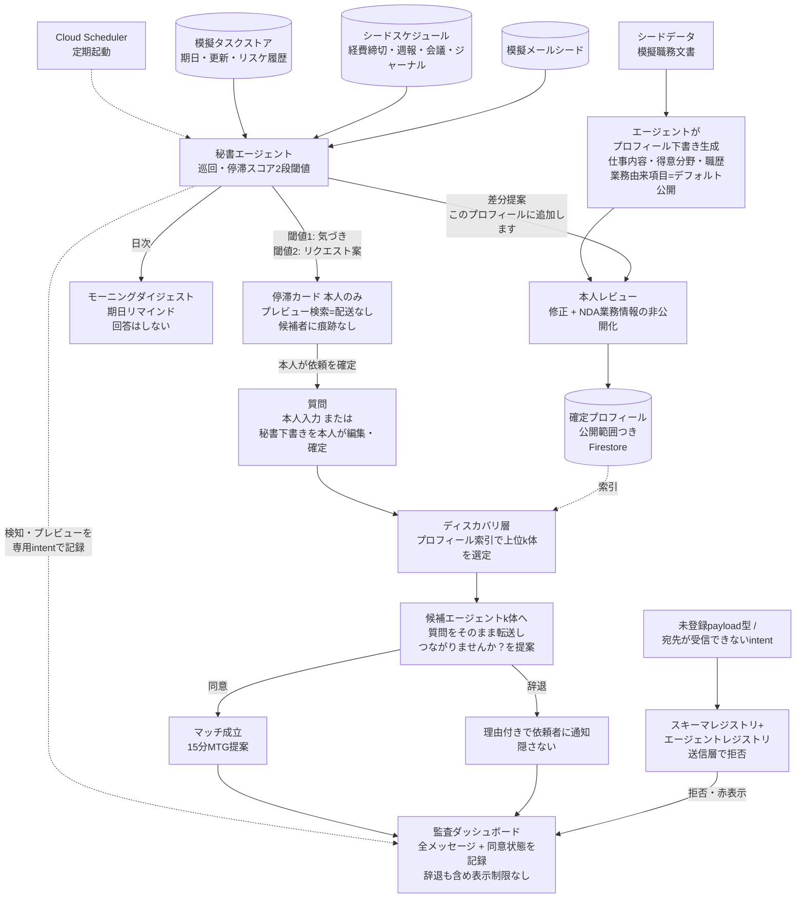

# knowledge-discovery 仕様書 v7

生成元: `source-input.md`（初版）／ 補助文脈: `context-chat.md`／ v2改訂: design-loop承認CP後のユーザーとの対話（2026-08-18）／ v3改訂: 根本思想の明確化（2026-08-18）／ v4改訂: AI生成制限の撤廃・辞退時ドキュメント回答・private項目の意味の反転（2026-08-18）／ v5改訂: design.md v7への文言追随（批評round-5 C-22）／ v6改訂: デモ舞台の方向性確定（事業・部署を跨ぐ接続を中心に据える）とCRM差別化の明記。具体の舞台は候補検討中（未決）／ v7改訂: 秘書（プロアクティブ）層・モーニングダイジェスト・プロフィール継続更新の追加、GEAP採用範囲の確定（2026-08-19）
生成日: 2026-08-17（v1） / 改訂日: 2026-08-18（v2〜v6）／ 2026-08-19（v7）

## v7改訂の経緯

M1/M2実装・反証round-6クローズ後のユーザーとの対話（2026-08-19）で、**秘書（プロアクティブ）層**が追加された。動機: 「質問を入力すると繋いでくれる」という受動的な入口だけでは、エージェントが普段から仕事を見てくれているという大元の説得性が弱い、というユーザーの指摘。ハッカソン募集文の "agents that run in the background... automate complex workflows asynchronously" への直接の応答にもなる。

1. **秘書エージェントの追加（M3）**: タスクの停滞を検知し、プレビュー検索（配送なし）で候補まで用意した上で、本人の依頼確定があって初めて既存のつながりレーンに合流する。「気づく・調べる」までは自律、「人を巻き込む」は本人確定必須。停滞検知は説明可能性のためルールベース（重み付きスコア＋2段閾値）とし、LLM判定を用いない。検知事実は本人以外に通知しない（監視ツール化の防止。Starmind等への対抗軸「監視型の対極」を維持）。**秘書自体は審査上の主張点にしない**——大元機能の説得性を支える土台と位置づける。
2. **モーニングダイジェスト（デフォルトリマインダー）**: 経費精算締切・週報/月報準備・会議の準備/振り返り・ジャーナルの期日リマインドをデフォルト搭載。接続提案だけの秘書は「普段黙っていて突然停滞を指摘する監視者」に見えるため、日常の地味な有用性で信頼の土台を作り、その延長に停滞検知カードを乗せる。なお v2 非スコープ（事務的単純事実への回答の廃止）は「回答経路を人的接続に一本化した」という判断であり、期日リマインドはこれと矛盾しない（**回答はしない、リマインドのみ**）。
3. **プロフィール継続更新**: 初回レビュー一回きりだったプロフィールを、秘書が模擬メール等のシードから差分提案（「このプロフィールに追加します」→本人レビュー）する形でオンタイム更新に拡張する。
4. **苦手分野の先回り検索（stretch）**: 停滞履歴のカテゴリ集計から「繰り返し停滞する分野」を導き、相談先候補を先回りで常備する構想。推定された苦手プロフィールは本人のエージェントのみが保持する（索引不掲載・監査には実行事実のみ）。実装はstretch、write-up・アーキ図には将来構成として必載。
5. **GEAP採用範囲の確定**: Agent Registry を実採用し、秘書エージェントは2段構えで Agent Runtime へ載せる。Gemini Enterprise（SaaS）のスケジューラ利用と Gemini Spark の実接続は却下（検討済み・却下を参照）。

## v4改訂の経緯

design.md 再起草前の構想レビューで、ユーザーから3点の変更指示があった:

1. **「AIが要約・生成した文章を候補に見せない」制約を撤廃**。安全側に倒しすぎて設計全体を歪めていた。残る原則は「未レビューのAI生成文を本人の発言として（本人名義で）流通させない」の一点のみ。AIがAIとして要約・推論・紹介文を書くのは全て自由。
2. **辞退時にドキュメント回答を添付可能に**。辞退が「拒絶」ではなく「会うほどではないが、これで足りるなら」という中間の返し方になる。
3. **private項目の意味を反転**（旧: マッチングから完全除外される死んだデータ → 新: **本人のエージェントだけが知っている情報**）。NDAに限らず、本人が意図的に公開プロフィールから外したもの全般。関連する質問が来たとき、本人のエージェントが本人にだけ「この質問、あなたの非公開項目に関係しそうですが、つながりますか？」とお伺いを立てる。内容を明かすかどうかは、会った本人がその場で判断する。「本人だけが開示を判断できる」という情報主権の実体となる機能。

## v3改訂の経緯

v2確認の際、ユーザーから根本思想の明確化があった:

1. **本プロダクトの定義**: 「人と人の暗黙知を繋いでシナジーを生み出すためのもの」。単一レーン構造（v2）の背骨にあった思想を、より明確な一文として立てる。
2. **マッチング精度の考え方**: 「この人ならこれを知ってる」という確定情報である必要はない。「もしかしたらこの人は背景情報から詳しいかも」という粒度のマッチングで構わない。むしろこの探索的・確率的な性質こそが、確定的な高精度マッチングを追求する既存サービス（Starmind等）との差別化になる。
3. **プロフィールへの追加**: 「その会社でしている仕事」を項目として追加し、割と詳しく書く。詳細な現在業務の記述が、探索的マッチング（暗黙知の匂いを嗅ぎ取る）の材料になる。

v2の単一レーン構造・辞退の可視化・NDAスコープ等はそのまま維持し、上記3点を反映する。

提出先: All Things Agentic Hackathon（Devpost / Google）／ トラック: The Fortified Enterprise Fleet／ 締切: 2026-08-31 17:00 PDT（= 9/1 09:00 JST）

## v2改訂の経緯（重要）

design.md v1〜v4（design-loop批評3ラウンド、指摘15件）はすべて「レーン1＝文書引用で完結する情報レーン」「レーン2＝解決不能な場合のみ人間に会う」という**旧2レーン構造**を前提に組み立てられていた。承認チェックポイントでユーザーから以下の指摘があり、前提そのものが誤りと判明した:

1. **目的の取り違え**: 本プロダクトの目的は「情報を得ること」ではなく「人と人のつながりを生み出すこと」。純粋な情報取得だけならRAGで十分であり、そこを解こうとすると既存のRAG製品と変わらない陳腐なプロダクトになる。
2. **想定質問の誤り**: 本プロダクトが扱うべき問い合わせは、文書に落ちない背景・経緯・肌感・人間関係が絡むものであり、事務的な単純事実（経費精算の締め日等）はそもそも本プロダクトが解く問題ではない。
3. **辞退の扱いの誤り**: 「辞退を依頼者から隠す」というハブ保護の発想（旧決定5）を撤回。AIによる効率化が進むからこそ、人が10〜15分の時間を割いて向き合うことが組織を強くするという価値観に立ち、辞退は理由を添えて依頼者に正直に返す（誰とも会いたくない人はこのプロダクトの対象外）。
4. **プロフィールの想定内容の誤り**: design.mdの批評で使われた悪性クエリ例「田中さんの給与を教えて」は、プロフィールに給与等の個人情報が載る前提を誤って持ち込んだもの。プロフィールが扱うのは仕事内容・得意分野・簡易な職歴（バックグラウンド）であり、非公開設定はNDA対象の業務情報にのみ使う。

これにより**旧2レーン構造を単一レーン構造（常に「つながりませんか？」を提案する）に置き換える**。design.md はこのv2を入力として design-loop を再起動する。

## 目的

**本プロダクトは、人と人の暗黙知を繋いでシナジーを生み出すためのものと定義する。** 社員一人一人に付く個人AIエージェント群が「これって社内の誰に聞けばいい？」を解決し、実際に人と人のつながりを生み出すマルチエージェントシステムを、2週間でデモ可能な状態まで作る。

設計思想: **AIによる効率化が進むからこそ、組織を強くするのは人と人のつながりである。** 事務的な単純事実確認（既存のRAG/FAQツールで十分な範囲）は本プロダクトが解く問題ではない。本プロダクトが扱うのは、文書に落ちていない背景・経緯・肌感・人間関係が絡む問い合わせであり、それは人に会うことでしか得られない。ゆえに、候補者が見つかった時点で常に「つながりませんか？」を提案する。断ることは自然な社会的行為として扱い、理由を添えて依頼者に正直に返す（隠さない）。全エージェント間通信は本人同意ゲート付きで監査可能。

**マッチングの精度についての考え方（v3で明確化）**: マッチングは「この人ならこれを知っている」という確定情報である必要はない。**「もしかしたらこの人は背景情報から詳しいかもしれない」という粒度で構わない。** 暗黙知は本人も言語化できていないことが多く、確定的な検索ではそもそも見つからない。この探索的・確率的なマッチングこそが、確定的な高精度マッチング（「詳しい人を正確に当てる」）を追求する既存サービス（Starmind等のexpertise location市場）との明確な差別化になる。既存勢が「検索の精度」を競う一方、本プロダクトは「意外な、しかし価値のある接続」を積極的に許容する。

一言説明（Devpost登録済み文言。**単一レーン構造への転換に伴い改訂が必要。後で変更可のため未決事項に記載**）:
> （旧）A multi-agent knowledge-discovery system where every employee's personal agent answers "who should I ask about this?" — agents resolve information requests among themselves, and involve humans only when the connection itself is the value. All inter-agent disclosure is owner-approved, consent-gated, and auditable.
>
> （新・ドラフト）A multi-agent knowledge-discovery system where every employee's personal agent finds who in the company can help — not by delivering a document, but by proposing a real connection. Declines are handled with the same courtesy as a real workplace conversation: visible, with a reason, never hidden. All inter-agent activity is consent-gated and auditable.

**入口の拡張（v7）**: 質問の入口を「人が質問を思いつく」だけに置かない。秘書（プロアクティブ）層が仕事の停滞に気づき、候補を用意した状態で本人に差し出す（スコープ10〜12）。秘書は独立機能として審査に主張しない。エージェントが普段から仕事のそばにいる（毎朝のリマインド・プロフィールの手入れをしてくれる）からこそ、「聞けば社内の誰かに繋いでくれる」という中核機能が信頼される——その説得性の土台である。

既存カテゴリ（Starmind / Glean / Microsoft Viva Topics）は「会社がデータを吸って自動でプロフィールを構築し、質問をエキスパートに届ける」監視型・情報伝達型である。本システムはその対極に立つ。既存勢が「情報を届けて終わり」なのに対し、本システムは**情報の受け渡しそのものを目的にせず、常に人と人の接続を生み出す**ことを目的とする。また、CRM（Salesforce等）は事業部内の顧客・案件を記録するが、本システムが扱うのは**事業・部署を跨ぐ暗黙知の接続**——守秘・人間関係・案件の機微ゆえにCRMには構造的に載らない情報——であり、CRMの代替ではなくCRMが空ける穴への回答である。

## スコープ

1. 模擬社員4名ぶんの個人エージェント（ADKマルチエージェント構成、完全な対話実装）
2. プロフィール生成・レビューフロー: エージェントがシードデータ（模擬職務文書）から下書きを生成し、業務由来項目はデフォルト公開とする。本人は一度のレビューで下書きの修正・NDA/秘匿項目の非公開化のみを行う（全項目の逐一承認は行わない）。プロフィール項目は以下を想定し、個人のプライバシー情報（給与等）は扱わない:
   - **その会社でしている仕事（詳細）**: 現在担当しているプロジェクト・業務内容・関わっている案件を、探索的マッチングの材料になる程度に具体的に記述する（v3で追加。ここが暗黙知マッチングの主要な手がかりになる）
   - 得意分野・専門性
   - 簡易な職歴（バックグラウンド）
3. **単一レーン（つながりレーン）**: 質問→ディスカバリ層がプロフィール索引で上位k体を選定→各候補へ「つながりませんか？」を提案。候補本人には、質問（AIが要約してよい）と「あなたが候補になった理由」（AIが推論・生成する）を提示する。AI生成文はAIの発言として明示し、本人の発言として見せない
4. 候補が同意した場合のみマッチ成立→15分MTG提案
5. 候補が辞退した場合、**理由（本人が自由記述、またはテンプレから選択）を添えて依頼者に返す**。辞退の事実は隠さない。**任意で、代わりになりそうな資料・リンク・一言回答を添付できる**（「会うほどではないが、これで足りるなら」という中間の返し方を可能にする）
6. 公開範囲: プロフィール項目ごとに公開/非公開のトグル。**非公開項目は「本人のエージェントだけが知っている情報」**（NDA案件に限らず、本人が意図的に公開から外したもの全般）。関連する質問が来たとき、本人のエージェントが本人にだけ「この質問はあなたの非公開項目に関係しそうです。つながりますか？」とお伺いを立てる。非公開項目の内容が依頼者・他エージェントに開示されることはなく、明かすかどうかは会った本人がその場で判断する
7. 監査ダッシュボード（＝エージェントチャンネル可視化画面）: 全エージェント間メッセージのログを人間可読で表示（誰が・何を・同意状態つき）。辞退も含め表示に制限を設けない（隠す必要がなくなったため実装が簡素化する）。非公開項目に触れる不正なクエリの拒否は同画面に赤表示。非エンジニアが5秒で異常に気づける画面を目標
8. デモ動画（3分・英語）: モーニングダイジェスト→停滞検知カード→本人の依頼確定を冒頭に置き、以降は候補提示→同意→MTG成立の幸福経路、および辞退→理由付きで依頼者に届く経路、の1シナリオ一本道（デモの質問は秘書の下書きを本人が確定したものとして始まる）
9. アーキテクチャ図と英語write-up
10. **秘書エージェント（プロアクティブ層、M3）**: 各担当者のタスクデータを定期巡回し、重み付き停滞スコア（2段閾値）で停滞を検知。閾値超えで気づきカード／つながりリクエスト案（プレビュー検索＋質問文下書き）を本人にのみ提示し、本人の依頼確定で既存のつながりレーンに合流する。審査上の主張点にはしない
11. **モーニングダイジェスト（デフォルトリマインダー）**: 経費精算締切・週報/月報準備・会議の準備/振り返り・ジャーナルの期日リマインドカード。シードのスケジュールデータ＋日付ルールのみで実装
12. **プロフィール継続更新**: 秘書が模擬メール等のシードから差分を検出し「このプロフィールに追加します」と提案→本人レビュー（反映・編集・公開範囲変更・見送り）で反映。初回レビュー（スコープ2）を一回きりにせず、オンタイムで回す仕組みにする

## 非スコープ（明示的に作らない）

- **事務的・手続き的な単純事実への回答**（経費精算の締め日、休暇申請方法等）。これは既存のRAG/FAQツールの領域であり、本プロダクトが解く問題ではない（v2で追加。旧レーン1「情報レーンで文書引用のみ返す」経路そのものを廃止した）
- 実GWSデータ連携（カレンダー/Gmail/議事録の取り込み）— シードデータで代替
- 1on1支援機能全般（別プロダクト、Zenn vol.5側で提出）
- 被マッチクォータ、workload連動の応答提案
- 貢献の可視化（余裕があれば簡易カウンタのみ、stretch扱い）
- 組織集計・属人化リスクの経営向け検出
- 本番想定の認証・マルチテナント
- **リマインド対象の手続き内容への回答**（経費精算のやり方等）— リマインドは期日通知のみ。v2の「回答経路の廃止」判断を維持する
- リマインド設定のCRUD画面・実カレンダー/実メール連携（スケジュール・メールはすべてシードデータ固定）
- 苦手分野の先回り検索の実装 — stretch扱い（機能要件24。write-up・アーキ図への記載は必須）

## 機能要件

1. システムは模擬社員4名分の個人AIエージェントをADK（Python）マルチエージェント構成で実装する。
2. 各エージェントは、シードデータ（模擬職務文書）からプロフィール下書きを自動生成し、業務由来項目をデフォルト公開状態で提示する。プロフィール項目は「現在の仕事内容（詳細）」「得意分野・専門性」「簡易な職歴」に限定する。「現在の仕事内容」は探索的マッチングの主要な手がかりとなるため、他の2項目より詳しく記述する。
3. 本人は一度のレビュー画面で、下書き内容の修正、およびNDA/秘匿項目の公開範囲（公開/非公開）変更のみを行い、確定させる。
4. システムは、質問入力を受け取ると、ディスカバリ層がプロフィール索引から上位k体の候補エージェントへ配送する。この選定は「質問に確実に答えられる人」を特定するものではなく、「プロフィール内容（特に現在の仕事内容）から見て、背景知識を持っていそうな人」を確率的に探索するものとする。誤マッチ（結果的に的外れな接続）はゼロを目指さない。
5. 配送された各候補エージェントは、依頼者の質問（AIが要約してよい）と「あなたが候補になった理由」（AIが推論・生成）を本人へ提示し、「つながりませんか？」の同意確認を行う。AI生成文は常にAIの発言として明示し、いかなる人物の発言としても表示しない。
6. 本人が同意した場合のみマッチが成立し、15分ミーティングの提案が生成される。
7. 本人が辞退した場合、辞退理由（本人記入）を添えて依頼者側に表示・通知する。辞退の事実は隠さない。辞退時に、任意で資料・リンク・一言回答を添付でき、依頼者にそのまま届く。
8. プロフィールは項目ごとに公開/非公開のトグルを持つ。非公開項目は本人のエージェントだけが参照でき、関連する質問が来た場合は本人にのみ「非公開項目に関係しそうな質問が来ています。つながりますか？」と打診する。非公開項目の**内容**は依頼者・他エージェント・監査画面のいずれにも開示されない。監査画面には「非公開項目に基づく打診が行われた事実」のみが記録される（内容はマスク）。非公開項目の存在を一切示さないのは依頼者向けUIに限る。
9. 全エージェント間通信は単一のメッセージエンベロープ（`from` / `to` / `intent` / `payload_type` / `payload` / `consent` / `audit_id`）で送受信される。
10. 流通可能な `payload_type` はスキーマレジストリに中央定義され、未登録の型を含むメッセージは送信層で拒否される。
11. 拒否されたメッセージを含む全メッセージが監査ログへ記録される。
12. 監査ダッシュボード（エージェントチャンネル可視化画面）は、全エージェント間メッセージを「誰が・何を・同意状態」つきで人間可読に表示する。辞退も含め表示に制限を設けない（例外は非公開項目関連の内容マスクのみ）。送信層で拒否されたメッセージ（未登録payload型・宛先が受信できないintent）は同画面に赤色表示される。
13. プロフィール索引には、Gemini合成の模擬社員プロフィール約400名分をFirestoreに実データとして投入する（完全な対話実装を持つのは4体のみとし、モック画面による見せかけは行わない）。
14. デモ動画は3分・英語で、モーニングダイジェスト→停滞検知カード→本人の依頼確定を冒頭シーンとし、以降は候補提示→同意→MTG成立の幸福経路、および辞退→理由（＋任意の資料添付）付きで依頼者に届く経路を1シナリオ一本道として構成する（機能羅列をしない。非公開項目打診シーン・秘書シーン追加後の尺配分はdesign.md側の設計判断に委ねる）。
15. アーキテクチャ図と英語write-upを提出物として作成する。write-upは既存カテゴリ（Starmind/Glean/Viva Topics）へのアンチテーゼとして位置づけ、Viva Topics撤退（2025/2）とCSCW研究の失敗要因（選定の社会的配慮）への設計回答であることを明記する。あわせて本番将来構成——個人側トリガーとしての Gemini Spark（MCP経由。社内前提のため実装外）、秘書の GEAP Agent Runtime 常駐、苦手分野の先回り検索——をアーキ図・write-upに明記する。「秘書は日常の地味な有用性で存在を許され、その信頼の上でだけ人を巻き込む提案をする」という設計理由を、CSCW失敗要因への回答の一部として記述する。
16. 秘書エージェントは、各担当者のタスクデータ（模擬タスクストア: タイトル・説明・期日・最終更新・リスケジュール履歴・status遷移履歴）を定期起動（Cloud Scheduler想定。デモでは手動トリガー可）で巡回する。常駐プロセスとしない。
17. 停滞検知はルールベースの重み付き停滞スコアで行い、LLM判定を用いない。シグナルは（a）期日超過日数、（b）無更新日数、（c）リスケジュール回数、（d）相対停滞（本人の他タスクは更新されているのに当該タスクのみ停止＝後回し検知）、（e）着手なし（作成以来status遷移なし）とする。カードには判定根拠を一行で明示する（例: 「期日を2回延ばし、他のタスクは動いているのにこれだけ5日止まっています」）。
18. 停滞スコアは2段閾値を持つ。閾値1超えで「気づきカード」を本人にのみ提示する。閾値2超えでプレビュー検索を自動実行し、質問文下書き＋候補＋候補理由（AI発言として明示）まで揃えた「つながりリクエスト案」カードを本人にのみ提示する。
19. プレビュー検索は配送を伴わない読み取り検索であり、公開プロフィール索引のみを対象とし、候補者側への通知・痕跡を一切発生させない。非公開項目の照合はプレビューでは行わない（非公開打診は要件8の正式配送フロー内でのみ発動する）。
20. 本人が「依頼する」を確定した場合のみ、下書き質問（本人編集可）が要件4以降の既存配送フローに乗る。秘書は本人の確定なしに配送する権限を持たない。停滞の検知事実は本人以外（上司・同僚を含む）に通知されない。
21. 秘書の検知イベントおよびプレビュー検索は、配送を伴わない専用intentとして監査ダッシュボードに記録される。
22. 秘書はモーニングダイジェストとして、期日もの（経費精算締切・週報/月報の準備・会議の準備/振り返り・ジャーナル記入）のリマインドカードをデフォルトで提示する。データはシードのスケジュールデータ＋日付ルールで生成し、手続き内容への回答は行わない（非スコープ）。停滞検知カード（要件17〜18）はこのダイジェストの中に、日常リマインドと地続きの1カードとして表示する。
23. 秘書は模擬メール等のシード文書から本人のプロフィール差分候補を検出し、「このプロフィールに追加します」という差分提案カードを本人に提示する。本人はレビューで反映・編集・公開範囲変更・見送りを選べる。UIは反映を既定の導線とし、見送りは明確な秘匿性がある場合の選択肢として配置する。反映されるとプロフィール索引が更新される。差分提案文はAI発言として明示し、本人の発言として流通させない（v4原則の適用）。
24. **（stretch）苦手分野の先回り検索**: 停滞履歴のカテゴリ集計から「繰り返し停滞する分野」を導き、平常巡回時に当該分野のプレビュー検索を先行実行して相談先候補を本人にのみ常備する。推定された苦手プロフィールは本人のエージェントのみが保持し、マッチング索引・他エージェント・監査画面のいずれにも掲載しない（監査には検索実行の事実のみ記録）。実装はstretchとし、アーキ図・write-upには将来構成として必ず記載する。

## 制約・非機能

- **実装スタック**: ADK（Python）+ Gemini 3.7 Flash（現行最新、2026年8月13日リリース）+ Cloud Run + Firestore。「Gemini 3.5 or newer」は「バージョン番号が3.5以上」の意であり、現行最新のProモデル（Gemini 3.1 Pro）はバージョン番号（3.1）が3.5未満のため要件を満たさない可能性が高い。Pro系統は使用せずFlash系のみで完結させる
- **締切**: 2026-08-31 17:00 PDT厳守。逆算で8/29までに機能凍結し、残りをデモ動画・アーキ図・英語write-upに充てる
- **技術要件（審査条件、募集要項より）**: 「Gemini 3.5 or newer（Gemini API または Vertex AI経由）」「Google Agent Framework（ADK / GenAI SDK / Antigravity SDK / GenKit のいずれか1つ以上）」「Google Cloudインフラサービス（Cloud Run / Cloud SQL / Firestore / GKE / Pub/Sub 等のいずれか1つ以上）」。ボーナス統合（任意）: Gemma / Veo / Lyria 等のGoogle AIモデル統合
- **コスト**: Google Cloud $150クレジット内（申請済み・承認待ち。未承認のまま開発期限が来た場合は個人課金＋予算アラートで進行）
- **運用**: Cloud Run は min-instances=0。デモ収録後は即停止。公開URLはAPIキー等で保護
- **GEAP採用**: **確定（2026-08-19）** — Agent Registry を実採用（自作エージェントとMCPツールを登録）。秘書エージェントは2段構えで GEAP Agent Runtime（API名 ReasoningEngine）へ載せる: まずCloud Run同居で実装・動作確認し、その後Runtimeへ載せ替える。載せ替えに詰まった場合はCloud Run版のままとし（フォールバック）、Registry登録は維持する。Model Armor / Agent Observability（明示的計装）はアーキ図上の将来構成として言及に留める。秘書の定期起動は Cloud Scheduler を用いる
- **開発体制**: 開発者1名、フルタイム勤務の業務外時間のみ（平日夜＋土日2回分程度）
- **評価基準（募集要項より、合計100%）**:
  - Innovation & Operational Utility — 40%: 自律的・高価値な行動で実世界の摩擦をどれだけ除去するか
  - Architectural Discipline & Tech Stack — 30%: システムの疎結合性・状態管理・認証情報のセキュリティ・障害処理などエンジニアリング判断の健全性
  - Demo & Production Readiness — 30%: デモ動画とリポジトリが機能性をどれだけ説得力を持って証明しているか
- **用語統一**: 「承認（approval）」は使わない。プロフィールの本人確認は「レビュー（検品）」、つながりレーンの応諾は「同意（consent）」、公開/非公開設定は「公開範囲（visibility）」と呼び分ける。英語表記は owner-reviewed / consent-gated / visibility

## 構造図

### 全体フロー（v2: 単一レーン構造）

## 検証可能な完了条件

1. サンプル質問を1件投げると、配送用ランキング（エージェント登録済みの候補）と画面用ファネル（400名分のスケール表示）の2トラックが動作し、接点が言語化できた候補に質問と「候補になった理由」（AI発言として明示）が提示されることを確認できる。
2. 候補が同意した場合、15分MTG提案が生成されることを確認できる。
3. 候補が辞退した場合、辞退理由を添えて依頼者側に表示されることを確認できる（旧v1の「辞退不可視」から反転）。辞退時に資料・リンク等を添付した場合、それが依頼者に届くことを確認できる。
4. 非公開項目に関係する質問が来た場合、本人にのみ打診が届き、非公開項目の内容が依頼者・他エージェントに表示されないことを確認できる。監査画面には打診の事実のみが記録され、内容はマスクされることを確認できる。
5. 監査ダッシュボードで、全メッセージ（辞退を含む）について「誰が・何を・同意状態」が一覧できることを確認できる。
6. 3分・英語の完成デモ動画が、モーニングダイジェスト→停滞検知カード→依頼確定→候補提示→同意→MTG成立、および辞退→理由が届く、の1シナリオ一本道で存在することを確認できる。
7. アーキテクチャ図、および既存カテゴリへのアンチテーゼとして位置づけた英語write-upが提出物として揃っていることを確認できる。
8. 用語（レビュー/同意/公開範囲）が実装・UI・write-up全体で統一され、「承認」という語が使われていないことを確認できる。
9. プロフィール項目が仕事内容・得意分野・簡易な職歴の範囲に収まっており、個人のプライバシー情報（給与等）を含まないことを確認できる。
10. 停滞条件を満たすシードタスクに対し、判定根拠一行つきの停滞カードが本人にのみ表示され、プレビュー段階では候補者側に通知・痕跡が一切発生せず、「依頼する」確定によって条件1〜3の既存配送フローが動作することを確認できる。
11. モーニングダイジェストに期日リマインド（経費締切・週報/月報・会議準備/振り返り・ジャーナル）が表示され、停滞カードが同ダイジェスト内に地続きで表示されることを確認できる。
12. 模擬メールのシードからプロフィール差分提案カードが提示され、本人レビューの反映によってプロフィール索引が更新されることを確認できる。
13. 秘書の検知イベント・プレビュー検索が、配送を伴わない専用intentとして監査ダッシュボードに記録されることを確認できる。

## 未決事項

- プロダクト名（未定。write-upまでに決める）
- Devpost登録済み一言説明の文言更新（単一レーン構造に合わせた新ドラフトを目的セクションに記載済み。確定は後で変更可のため急がない）
- **デモ動画への非公開項目打診シーンの組み込み方**: v4で追加された「非公開項目に関係する質問→本人にのみ打診」は情報主権の実体機能であり、Fortifiedトラックの訴求点としてデモに含める価値が高い。3分尺の中で幸福経路・辞退経路とどうバランスさせるかはdesign.md側で設計する。旧v1〜v4の「reject_visibility」「来歴検証」等の防御機構は旧2レーン構造前提のため廃止
- GEAPコンポーネントの採用範囲: **確定（2026-08-19）** — Agent Registry 実採用＋秘書の Agent Runtime 2段構え載せ替え（詳細は制約・非機能のGEAP採用の項）。Model Armor / Agent Observability は将来構成
- 停滞スコアの重み・2段閾値の具体値（M3実装時にシードデータで較正する）
- プロフィール差分提案シーンをデモ3分尺に含めるか（含めない場合もREADME・write-upで機能提示する）
- 本人レビューUIの形態: 最小Webアプリか、Slack風の模擬チャットUIか
- 監査ダッシュボードの実装方式: 専用画面か、Cloud Loggingベースの簡易ビューか
- デモ動画のナレーション: 自声英語か、TTSか
- デモの舞台となる業種・部門設定: **確定（2026-08-18、候補A+Dの合体をユーザー選択）** — 舞台は**医療系人材紹介を中核とし、不動産事業・事業承継（M&A）支援・管理部門を持つ複数事業グループ会社**。デモの中心は**事業・部署を跨ぐ接続**（部署内の「誰が詳しいか」はCRMで足りるため、デモ質問は必ず事業境界を跨ぐものにする）。メイン質問は実体験モチーフ（医療法人クライアントの移転相談→病院を建てられる土地を探せる人・探し方を知る人への接続）、非公開項目打診シーンは承継案件モチーフ（未公表の事業承継相談→守秘ゆえCRMに載らない暗黙知）を使う。いずれも作者が当事者として実感を持って語れる領域。模擬社員4名は事業部横断で配置し、「確実に落ちる1体」（質問と語彙が重ならない管理部門）を含める。具体の人物・ナレッジ設定はM2のシードデータ設計で詰める
- $150クレジットが未承認のまま推移した場合の個人課金切り替えタイミング
- 辞退理由の入力形式（自由記述のみか、テンプレ選択も併用するか）

## 検討済み・却下（参考）

- **2レーン構造（情報レーンで文書引用のみ返す＋接続レーン）— v2で却下**。理由: 事務的な単純事実確認はRAGの領域であり本プロダクトが解く問題ではない。文書引用のみで完結する経路を持つと既存RAG製品と差がなくなり陳腐化する。本プロダクトが扱う問い合わせは常に人的接続に価値があるという前提に立ち返った
- **辞退の不可視化 — v2で却下**。理由: 「断ることを容易にする」というハブ保護の発想（旧決定5）を撤回。AIによる効率化が進む中でこそ人が時間を割いて向き合うべき、という価値観に転換。理由付きの丁寧な辞退は正常な社会的やり取りとして可視化する
- エージェント間を全てenum/boolに縛る案 — 却下（マッチ精度が出ず過剰）
- 被マッチ月間クォータ＋2番手ルーティング — 却下（同意ベースの保護で足りる）
- クエリへのpurpose enum（情報取得/繋がりたい）付与 — 却下（v2では単一レーンのため、そもそも区別が不要になった）
- 非同期テキスト中継レーン — 却下
- 属人化リスクの経営向け検出 — スコープ外へ
- 1on1支援との同時提出 — 却下（Zenn vol.5へ分離）
- デモ舞台の医療機関固定 — 却下（作者は医療コンサル所属で現場当事者ではなく、ドメイン知識不足により不自然になるため）
- プロフィールに給与等の個人情報を含める想定 — 却下（v2で明記。design.md批評で誤って持ち込まれた例。プロフィールは仕事内容・得意分野・職歴のみ）
- **秘書層の外部OSS基盤（openclaw / openagent 等）の組み込み — 却下（2026-08-19）**。理由: 「タスクを見て停滞を検知しプロアクティブに動く」単機能のOSS部品は存在せず、いずれもスタンドアロンの大型アシスタント基盤。10日でCloud Run＋ADK構成へ統合するより薄い自前実装の方が確実に安い。規約上はライセンス遵守でOSS利用可だが、審査の得点は Gemini/ADK 自作部分にしか付かない
- **Gemini Enterprise（SaaS）の Agent Designer スケジュール実行の利用 — 却下（2026-08-19）**。理由: per-seat ライセンスが別途必要でハッカソン文脈に合わず、ADK自作部分の評価も薄まる。秘書の定期起動は Cloud Scheduler＋自作ADKエージェントで実装する
- **Gemini Spark の実接続をクリティカルパスに載せる — 却下（2026-08-19）**。理由: AI Ultra 契約・提供地域の制約に加え、個人アカウント（Gmail/カレンダー）連携はプラットフォーム自体のセキュリティ設計が必要で、社内前提の本プロダクトと境界が合わない。write-up・アーキ図の将来構成（個人側トリガー、MCP経由）としてのみ言及する

## v1からの主な変更点（サマリ）

| 項目 | v1 | v2 | v3 | v4 |
|---|---|---|---|---|
| レーン構造 | 2レーン（情報レーン＋接続レーン） | 単一レーン（つながりレーン） | 同左 | 同左 |
| 単純事実確認 | レーン1で対応 | 非スコープ（RAG等の別ツールの領域） | 同左 | 同左 |
| AIの生成 | レーン1で引用選定・回答生成 | 質問はそのまま転送。AIは要約・生成しない | 同左 | **生成制限を撤廃。AI発言として明示すれば要約・推論・紹介文いずれも自由**（本人名義で流通させないの一点のみ残す） |
| 辞退の可視性 | 依頼者に不可視 | 理由付きで依頼者に表示 | 同左 | 理由に加え**資料・リンク・一言回答を任意添付可能** |
| プロフィール内容 | 未定義（悪性クエリ例で給与が誤って混入） | 仕事内容・得意分野・簡易な職歴に限定 | 現在の仕事内容を詳細化して追加（暗黙知マッチングの主要材料） | 同左 |
| 非公開の対象 | 未定義 | NDA対象の業務情報のみ | 同左 | **本人が意図的に公開から外したもの全般。本人のエージェントだけが知っており、関連質問が来たら本人にのみ打診する**（マッチング除外の死んだデータから、情報主権の実体機能へ反転） |
| マッチング精度 | 未定義（確定的な回答を前提としていた） | 未定義 | **確定情報ではなく探索的・確率的なマッチングを明示的に許容**（プロダクトの核心的差別化） | 同左 |
| プロダクト定義 | 「誰に聞けばいいかを解決する」 | 同左 | **「人と人の暗黙知を繋いでシナジーを生み出す」を根本思想として明文化** | 同左 |
